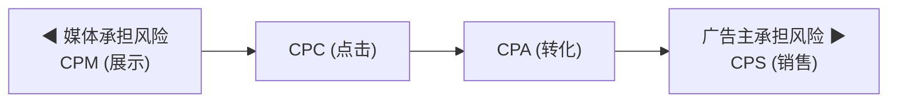
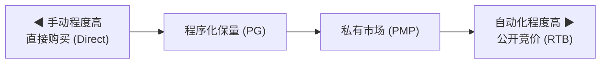

# 在线广告商业模式

## 一句话概述

在线广告的商业模式围绕"如何计费"和"如何交易"两个核心展开，从早期的 CPM 固定购买演进到如今以 oCPM/oCPC 为代表的智能出价模式。

---

## 计费模式全景



智能出价: oCPM / oCPC / tCPA / tROAS (平台承担优化责任)

---

## 基础计费模式

### CPM (Cost Per Mille) — 千次展示计费

- **定义**: 广告每展示 1000 次的费用
- **公式**: `费用 = 展示量 / 1000 × CPM 单价`
- **适用场景**: 品牌广告、开屏广告、品牌曝光
- **优点**: 媒体收入确定性高；适合品牌曝光目标
- **缺点**: 广告主承担效果风险；可能存在无效曝光
- **典型价格**: 
  - 信息流: ¥10–50
  - 开屏: ¥100–300
  - 朋友圈: ¥50–150

### CPC (Cost Per Click) — 点击计费

- **定义**: 用户每点击一次广告的费用
- **公式**: `费用 = 点击量 × CPC 单价`
- **适用场景**: 搜索广告、效果广告
- **优点**: 广告主只为有效互动付费
- **缺点**: 存在恶意点击风险；媒体收入不确定
- **典型价格**:
  - 搜索广告: ¥1–50 (行业差异大)
  - 信息流: ¥0.3–5

### CPA (Cost Per Action) — 转化计费

- **定义**: 用户完成指定行为 (注册/下载/购买) 的费用
- **公式**: `费用 = 转化量 × CPA 单价`
- **适用场景**: 应用下载、注册获客
- **优点**: 广告主风险最低，按效果付费
- **缺点**: 媒体风险高；归因困难；量级受限
- **变体**:
  - **CPL** (Cost Per Lead): 按线索计费
  - **CPI** (Cost Per Install): 按安装计费
  - **CPR** (Cost Per Registration): 按注册计费

### CPV (Cost Per View) — 视频观看计费

- **定义**: 用户观看视频广告达到一定时长的费用
- **计费标准**: 通常观看 ≥ 5s 或 ≥ 30s 或完整观看
- **适用场景**: 视频前贴片、信息流视频广告
- **平台差异**:
  - YouTube: 观看 30s 或完整观看 (取短者)
  - 抖音: 有效播放 (通常 ≥ 5s)

### CPS (Cost Per Sale) — 销售分成

- **定义**: 按实际销售额的一定比例计费
- **公式**: `费用 = 销售额 × 分成比例`
- **适用场景**: 电商广告、联盟营销 (Affiliate)
- **代表**: 淘宝客、京东联盟、Amazon Associates

---

## 智能出价模式 (重点)

### 为什么需要智能出价？

传统模式下广告主需要手动调整出价，效率低且依赖经验。智能出价让平台算法自动优化出价，广告主只需设定目标。

### oCPM (Optimized CPM)

- **机制**: 按 CPM 计费，但平台基于转化目标优化展示人群
- **广告主设定**: 期望的转化成本 (如 CPA ¥50)
- **平台行为**: 预估每次展示的转化概率，自动调整出价
- **公式**: `实际出价 = 目标CPA × pCVR × 1000`
- **主要平台**: 巨量引擎、腾讯广告、快手
- **这是当前国内效果广告最主流的计费模式**

### oCPC (Optimized CPC)

- **机制**: 按 CPC 计费，但平台基于转化目标优化点击人群
- **两阶段模式** (百度搜索广告):
  - 第一阶段: 正常 CPC 出价，积累转化数据
  - 第二阶段: 平台接管出价，按转化目标优化
- **主要平台**: 百度搜索、部分信息流平台

### tCPA (Target CPA)

- **机制**: 广告主设定目标转化成本，平台自动优化
- **与 oCPM 的区别**: tCPA 更强调成本达标的约束
- **主要平台**: Google Ads, Meta Ads

### tROAS (Target ROAS)

- **机制**: 广告主设定目标广告支出回报率
- **公式**: `ROAS = 转化价值 / 广告花费`
- **适用场景**: 电商广告，不同商品价值差异大
- **示例**: 设定 tROAS = 300%，即花 ¥1 广告费期望带来 ¥3 收入

### 最大转化量 (Maximize Conversions)

- **机制**: 在预算范围内，平台自动最大化转化数量
- **不设定目标成本**: 平台全权决定出价
- **适用场景**: 新账户冷启动、预算充足时快速起量

---

## 交易模式

### 按自动化程度分类



### 1. 直接购买 (Direct / IO)

- **方式**: 广告主与媒体直接签约 (Insertion Order)
- **特点**: 价格固定、位置确定、人工操作
- **适用**: 品牌广告、大型活动、独占资源 (如开屏)

### 2. 程序化保量 (Programmatic Guaranteed, PG)

- **方式**: 通过程序化系统执行，但价格和量级预先约定
- **特点**: 自动化执行 + 确定性保障
- **适用**: 品牌广告主需要确定曝光量

### 3. 私有市场 (Private Marketplace, PMP)

- **方式**: 媒体邀请特定广告主参与竞价
- **特点**: 优质流量、有限竞争、底价较高
- **适用**: 优质媒体资源的程序化售卖

### 4. 公开竞价 (Open Auction / RTB)

- **方式**: 所有 DSP 公开竞价，价高者得
- **特点**: 完全自动化、实时决策、长尾流量
- **适用**: 效果广告、大规模投放

### 竞价机制

| 机制 | 说明 | 应用 |
|------|------|------|
| **第二价格 (Second-Price / GSP)** | 胜出者支付第二高出价 + ¥0.01 | 传统 RTB |
| **第一价格 (First-Price)** | 胜出者支付自己的出价 | 当前主流 |
| **VCG** | 基于边际贡献计费 | 理论模型，Facebook 曾使用 |

**行业趋势**: 从第二价格向第一价格迁移 (2019 年后)

---

## 广告售卖方式对比

| 维度 | 品牌广告 | 效果广告 |
|------|---------|---------|
| **目标** | 曝光、认知、好感 | 转化、获客、ROI |
| **计费** | CPM / CPT (按天) | oCPM / oCPC / CPA |
| **购买** | 直接购买 / PG | RTB / 自助投放 |
| **预算** | 大 (百万级) | 灵活 (可小额) |
| **衡量** | 曝光量、品牌提升 | 转化量、CPA、ROAS |
| **占比趋势** | 下降 | 上升 (已超 70%) |

---

## 国内主流平台计费模式

| 平台 | 主要计费模式 | 特色 |
|------|-------------|------|
| **巨量引擎** | oCPM 为主 | 深度转化优化、自动出价 |
| **腾讯广告** | oCPM / oCPC | 社交场景、微信生态 |
| **百度营销** | oCPC (搜索) / oCPM (信息流) | 搜索广告两阶段 oCPC |
| **磁力引擎** | oCPM | 短视频 + 直播电商 |
| **阿里妈妈** | CPC (直通车) / CPM (钻展) | 电商场景、ROAS 导向 |

---

## eCPM — 统一度量标准

不同计费模式下，媒体需要统一的收入衡量标准：

```
eCPM = 每千次展示的预期收入

CPC 模式: eCPM = CPC × CTR × 1000
CPA 模式: eCPM = CPA × CVR × CTR × 1000
oCPM 模式: eCPM = bid × pCTR × pCVR × 1000

广告排序核心: eCPM 排序 (兼顾广告质量分)
```

---

## 与大数据开发的关联

- **计费数据管道**: 曝光/点击/转化日志的采集、清洗、聚合
- **实时计费**: Flink 实时计算消耗、预算控制
- **对账系统**: 广告主报表与内部数据的一致性校验
- **反作弊**: 识别无效点击/虚假转化，保护计费准确性
- **eCPM 预估数据**: 为算法提供特征数据和样本数据

---

## 面试高频问题

1. 请解释 CPM、CPC、CPA、oCPM 的区别和适用场景
2. oCPM 的出价逻辑是什么？平台如何保证广告主的成本目标？
3. 第一价格和第二价格竞价的区别？为什么行业从二价转向一价？
4. eCPM 是什么？为什么它是广告排序的核心指标？
5. 品牌广告和效果广告的核心区别是什么？

---

## 推荐阅读

- 《计算广告》第 2-3 章 — 商业模式与计费
- Google Ads 帮助中心 — 出价策略
- [巨量引擎投放指南](https://www.oceanengine.com/)
