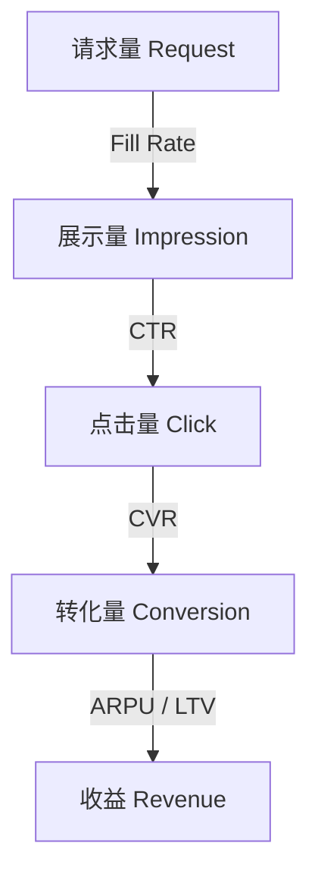

# 在线广告核心度量指标

## 一句话概述

广告指标体系围绕"曝光→点击→转化→收益"漏斗展开，不同角色关注不同层级的指标，eCPM 是连接媒体与广告主的统一度量标准。

---

## 指标漏斗全景



---

## 流量侧指标

| 指标 | 英文 | 公式 | 说明 |
|------|------|------|------|
| **请求量** | Ad Request | — | 媒体向广告系统发送的请求次数 |
| **填充率** | Fill Rate | 返回广告数 / 请求数 | 广告系统有多少请求能返回广告 |
| **展示量** | Impression | — | 广告实际展示给用户的次数 |
| **可见展示** | Viewable Impression | — | 满足可见性标准的展示 (MRC: 50%像素可见≥1s) |
| **展示率** | Show Rate | 展示数 / 返回数 | 返回的广告有多少真正展示了 |

---

## 效果侧指标

### 点击相关

| 指标 | 英文 | 公式 | 说明 |
|------|------|------|------|
| **点击量** | Click | — | 用户点击广告的次数 |
| **点击率** | CTR (Click-Through Rate) | 点击数 / 展示数 | 核心效率指标 |
| **独立点击** | Unique Click | — | 去重后的点击用户数 |

**CTR 参考值**:
- 搜索广告: 2%–10%
- 信息流广告: 1%–3%
- Banner 广告: 0.1%–0.5%
- 开屏广告: 3%–8%

### 转化相关

| 指标 | 英文 | 公式 | 说明 |
|------|------|------|------|
| **转化量** | Conversion | — | 用户完成目标行为的次数 |
| **转化率** | CVR (Conversion Rate) | 转化数 / 点击数 | 从点击到转化的效率 |
| **深度转化** | Deep Conversion | — | 更深层行为 (付费/留存/复购) |
| **转化成本** | CPA | 花费 / 转化数 | 获取一个转化的成本 |

**转化定义示例**:
- 电商: 下单、支付
- 游戏: 下载、激活、注册、付费
- 线索: 表单提交、电话拨打
- 内容: 关注、下载 App

---

## 收入侧指标

| 指标 | 英文 | 公式 | 说明 |
|------|------|------|------|
| **eCPM** | Effective CPM | 收入 / 展示数 × 1000 | 每千次展示收入，媒体核心指标 |
| **ARPU** | Avg Revenue Per User | 总收入 / 用户数 | 每用户平均收入 |
| **RPM** | Revenue Per Mille | 收入 / 页面浏览 × 1000 | 每千次页面浏览收入 |

### eCPM 在不同计费模式下的计算

```
CPM 模式:  eCPM = CPM 出价 (直接)
CPC 模式:  eCPM = CPC × CTR × 1000
CPA 模式:  eCPM = CPA × CVR × CTR × 1000
oCPM 模式: eCPM = bid × pCTR × pCVR × 1000
```

---

## 广告主侧指标

| 指标 | 英文 | 公式 | 说明 |
|------|------|------|------|
| **花费** | Spend / Cost | — | 广告总消耗 |
| **ROI** | Return on Investment | (收入 - 成本) / 成本 | 投资回报率 |
| **ROAS** | Return on Ad Spend | 转化收入 / 广告花费 | 广告支出回报率 |
| **LTV** | Lifetime Value | — | 用户生命周期价值 |
| **CAC** | Customer Acquisition Cost | 总获客成本 / 新客数 | 获客成本 |
| **回收周期** | Payback Period | — | 广告成本回收所需时间 |

### ROI vs ROAS

```
ROI = (收入 - 广告花费) / 广告花费 × 100%
ROAS = 收入 / 广告花费

示例: 花费 ¥1000，带来 ¥3000 收入
  ROI  = (3000 - 1000) / 1000 = 200%
  ROAS = 3000 / 1000 = 3 (或 300%)
```

---

## 竞价侧指标

| 指标 | 英文 | 公式 | 说明 |
|------|------|------|------|
| **竞价参与率** | Bid Rate | 出价次数 / 请求次数 | DSP 参与竞价的比例 |
| **胜出率** | Win Rate | 胜出次数 / 出价次数 | 竞价胜出的比例 |
| **出价** | Bid Price | — | 竞价时的出价金额 |
| **成交价** | Clearing Price | — | 实际支付的价格 |
| **质量分** | Quality Score | — | 平台对广告质量的评分 |

---

## 品牌广告指标

| 指标 | 英文 | 说明 |
|------|------|------|
| **到达率** | Reach | 广告触达的独立用户比例 |
| **频次** | Frequency | 每个用户平均看到广告的次数 |
| **GRP** | Gross Rating Point | 到达率 × 频次，品牌曝光总量 |
| **品牌提升** | Brand Lift | 广告对品牌认知/好感/意向的提升 |
| **可见性** | Viewability | 可见展示占总展示的比例 |
| **品牌安全** | Brand Safety | 广告未出现在不当内容旁边 |

---

## 反作弊指标

| 指标 | 英文 | 说明 |
|------|------|------|
| **IVT 率** | Invalid Traffic Rate | 无效流量占比 |
| **GIVT** | General IVT | 一般无效流量 (爬虫、数据中心) |
| **SIVT** | Sophisticated IVT | 复杂无效流量 (模拟器、刷量) |
| **异常点击率** | Abnormal Click Rate | 异常点击占总点击比例 |

---

## 各角色关注的核心指标

| 角色 | 核心关注指标 |
|------|-------------|
| **广告主** | CPA, ROAS, ROI, LTV, CAC |
| **媒体** | eCPM, Fill Rate, ARPU, 收入 |
| **平台** | 收入, eCPM, CTR, CVR, 广告主数 |
| **算法** | CTR, CVR, AUC, GAUC, 校准度 |
| **大数据** | 数据延迟, 数据准确性, 对账差异 |

---

## 指标之间的数学关系

```
收入 = 展示量 × CTR × CPC
     = 展示量 × CTR × CVR × CPA
     = 展示量 × eCPM / 1000

广告主成本:
  CPA = CPC / CVR = CPM / (CTR × CVR × 1000)

媒体收入:
  eCPM = CTR × CPC × 1000 = CTR × CVR × CPA × 1000

平台利润:
  利润 = 广告主花费 × 平台抽成比例
```

---

## 与大数据开发的关联

- **指标计算管道**: 实时/离线计算各层级指标
- **数据口径一致性**: 不同系统间指标定义和计算逻辑对齐
- **报表系统**: 多维度指标聚合与展示
- **数据对账**: 内部数据与第三方监测数据的差异分析
- **异常检测**: 指标异常波动的实时监控和告警
- **归因数据**: 转化归因链路的数据处理

---

## 面试高频问题

1. CTR 和 CVR 分别是什么？如何计算？
2. eCPM 是什么？在不同计费模式下如何计算？
3. ROI 和 ROAS 的区别是什么？
4. 广告主、媒体、平台分别关注哪些核心指标？
5. 如何保证广告数据报表的准确性？

---

## 推荐阅读

- 《计算广告》第 4 章 — 广告效果衡量
- [MRC (Media Rating Council) 可见性标准](http://mediaratingcouncil.org/)
- [IAB 广告度量指南](https://www.iab.com/)
