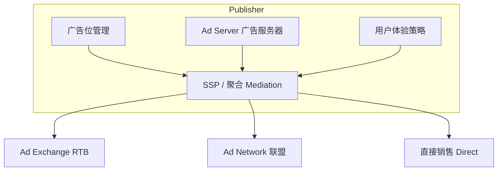
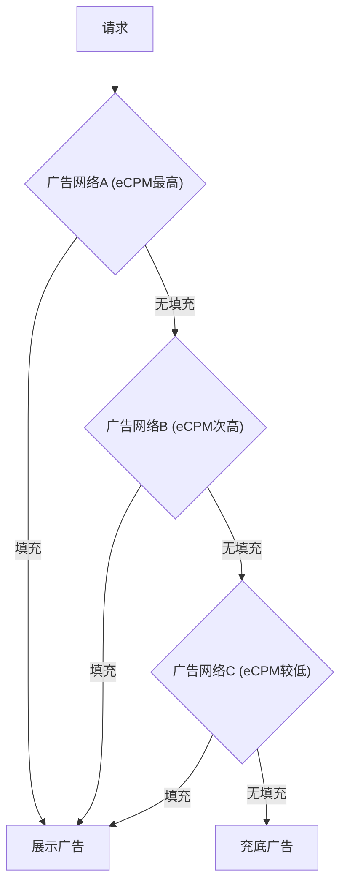
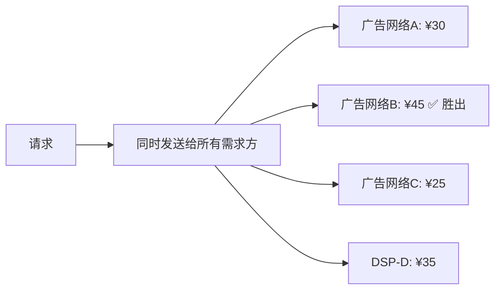

# 媒体侧 (Supply Side)

## 一句话概述

媒体侧是广告生态的供给方，拥有用户流量和广告位资源，核心目标是在保障用户体验的前提下最大化广告收入 (eCPM × 展示量)。

---

## 媒体侧生态架构



---

## 媒体类型

### 按内容形态分类

| 类型 | 代表 | 主要广告形式 | eCPM 水平 |
|------|------|-------------|----------|
| **搜索引擎** | 百度、Google、Bing | 搜索广告 | 高 (¥50–200) |
| **社交媒体** | 微信、微博、Facebook | 信息流、朋友圈 | 中高 (¥30–100) |
| **短视频** | 抖音、快手、YouTube | 信息流视频、开屏 | 中高 (¥20–80) |
| **新闻资讯** | 今日头条、腾讯新闻 | 信息流、Banner | 中 (¥10–40) |
| **电商** | 淘宝、京东、拼多多 | 搜索广告、推荐广告 | 高 (¥50–300) |
| **工具类 App** | 天气、输入法、浏览器 | 开屏、Banner、插屏 | 低 (¥5–20) |
| **游戏** | 休闲游戏、超休闲 | 激励视频、插屏 | 中 (¥20–60) |
| **长视频** | 优酷、爱奇艺、B站 | 前贴片、中插、暂停 | 中高 (¥30–80) |

### 按流量规模分类

| 类型 | 特征 | 变现方式 |
|------|------|---------|
| **头部媒体** | DAU > 1亿，自建广告系统 | 自有投放平台 + 直销 |
| **腰部媒体** | DAU 100万–1亿 | SSP/联盟 + 部分直销 |
| **长尾媒体** | DAU < 100万 | 纯联盟/聚合变现 |

---

## SSP (Supply-Side Platform)

### 定义
帮助媒体管理和优化广告库存售卖的技术平台，连接多个需求方以最大化媒体收入。

### 核心功能

| 功能 | 说明 |
|------|------|
| **库存管理** | 管理不同广告位、格式、尺寸 |
| **底价设置** | 为不同广告位设置最低售卖价格 |
| **需求方接入** | 对接多个 DSP / Ad Exchange |
| **竞价优化** | 选择最优出价，最大化收入 |
| **数据分析** | 填充率、eCPM、收入等报表 |
| **广告质量控制** | 过滤低质量/违规广告 |

### 主要 SSP

| SSP | 说明 |
|-----|------|
| **Google Ad Manager (GAM)** | 全球最大，前身 DFP + AdX |
| **穿山甲 (CSJ)** | 字节跳动旗下，国内最大移动广告联盟 |
| **优量汇** | 腾讯旗下广告联盟 |
| **百青藤** | 百度旗下广告联盟 |
| **快手联盟** | 快手旗下 |
| **AppLovin MAX** | 全球移动广告聚合平台 |
| **ironSource** | 游戏广告变现 (已被 Unity 收购) |

---

## Ad Server (广告服务器)

### 定义
负责广告的存储、选择、投放和追踪的技术系统。

### 两类 Ad Server

| 类型 | 服务对象 | 功能 | 代表 |
|------|---------|------|------|
| **媒体侧 Ad Server** | 媒体 | 管理广告位、决定展示哪个广告 | Google Ad Manager |
| **广告主侧 Ad Server** | 广告主 | 素材托管、跨平台追踪 | Campaign Manager 360 |

### 媒体侧 Ad Server 的决策流程

```mermaid
flowchart TD
    A[用户访问页面/App] --> B[客户端向 Ad Server 发送广告请求]
    B --> C[Ad Server 按优先级检查:]
    C --> D[直接销售订单 (Direct / Sponsorship)]
    C --> E[程序化保量 (PG)]
    C --> F[私有市场 (PMP)]
    C --> G[公开竞价 (RTB)]
    G --> H[选择最优广告返回]
    H --> I[客户端渲染广告]
    I --> J[上报曝光/点击事件]
```

---

## 广告位管理策略

### Waterfall (瀑布流)



- **原理**: 按历史 eCPM 排序，依次请求
- **问题**: 基于历史均值，无法获取实时最优价格；先到先得，低估了部分网络的出价

### Header Bidding (头部竞价)



- **原理**: 所有需求方同时竞价，价高者得
- **优势**: 公平竞争，收入提升 10%–30%
- **挑战**: 延迟增加、技术复杂度高

### In-App Bidding (应用内竞价)

- Header Bidding 在移动端的实现
- 代表: AppLovin MAX, Google Open Bidding
- 趋势: 逐步替代 Waterfall

---

## 流量变现策略

### 广告位设计原则

1. **用户体验优先**: 广告不能过度干扰用户
2. **广告密度控制**: 广告占内容比例 (Ad Load)，通常 10%–20%
3. **频次控制**: 同一用户看到同一广告的次数限制
4. **广告位多样化**: 不同位置、不同格式组合

### 常见广告位类型

| 广告位 | 特点 | eCPM | 用户体验 |
|--------|------|------|---------|
| **开屏** (Splash) | App 启动时全屏展示 | 最高 | 中等 |
| **信息流** (Feed) | 融入内容流 | 高 | 好 |
| **Banner** | 页面顶部/底部横幅 | 低 | 差 |
| **插屏** (Interstitial) | 全屏弹出 | 中高 | 差 |
| **激励视频** (Rewarded) | 用户主动观看换奖励 | 高 | 好 |
| **原生** (Native) | 与内容样式一致 | 中高 | 好 |
| **前贴片** (Pre-roll) | 视频播放前 | 高 | 中等 |

### 收入优化手段

- **A/B 测试**: 不同广告位/策略的效果对比
- **动态底价**: 根据流量质量动态调整底价
- **智能插入**: 算法决定最佳广告插入时机
- **混合变现**: 广告 + 内购 + 订阅的组合策略

---

## 广告联盟 (Ad Network)

### 定义
聚合多个中小媒体的广告库存，统一售卖给广告主的平台。

### 国内主要广告联盟

| 联盟 | 母公司 | 特点 |
|------|--------|------|
| **穿山甲** | 字节跳动 | 国内最大，流量质量高 |
| **优量汇** | 腾讯 | 微信小程序流量 |
| **百青藤** | 百度 | 搜索+信息流 |
| **快手联盟** | 快手 | 短视频流量 |
| **Sigmob** | 独立 | 游戏行业为主 |
| **Mintegral** | 汇量科技 | 出海为主 |

### 联盟 SDK 集成

```
App 集成流程:
1. 注册联盟账号，创建应用和广告位
2. 集成联盟 SDK (通常 1–5MB)
3. 在代码中调用 SDK 请求和展示广告
4. 配置广告位参数 (刷新频率、超时等)
5. 测试验证
6. 上线并监控数据
```

---

## 与大数据开发的关联

- **日志采集**: 广告请求/展示/点击日志的采集和传输
- **实时数据管道**: 广告事件的实时处理 (Kafka → Flink)
- **eCPM 分析**: 不同维度的 eCPM 分析和优化
- **填充率优化**: 分析填充率低的原因和优化方向
- **流量质量评估**: 识别低质量流量和作弊流量
- **收入报表**: 媒体收入的多维度统计和对账
- **A/B 实验数据**: 广告策略实验的数据分析

---

## 面试高频问题

1. SSP 的核心功能是什么？与 Ad Network 的区别？
2. Waterfall 和 Header Bidding 的区别和优劣？
3. 媒体如何平衡广告收入和用户体验？
4. 常见的广告位类型有哪些？各自的特点？
5. 广告联盟的商业模式是什么？

---

## 推荐阅读

- 《计算广告》第 6 章 — 供给方平台
- Google Ad Manager 官方文档
- [穿山甲开发者文档](https://www.csjplatform.com/)
