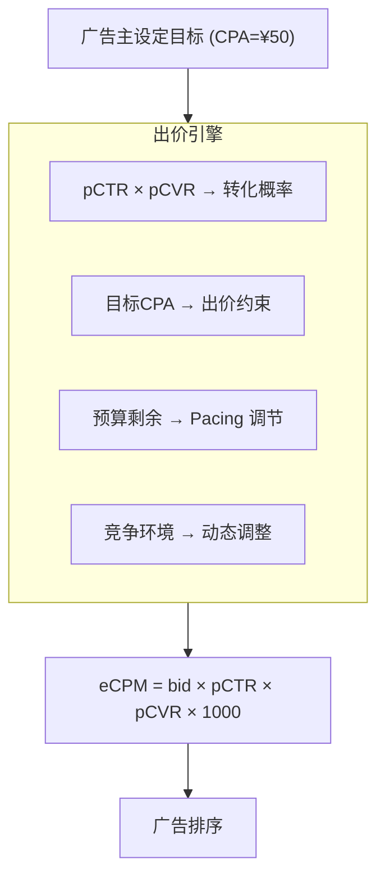

# 出价与预算优化 (Bidding & Budget Optimization)

## 一句话概述

出价优化是广告系统的"定价引擎"，核心目标是在满足广告主成本约束的前提下，最大化平台收入或广告主转化量，从手动出价演进到 AI 全自动出价。

---

## 出价在广告系统中的位置



---

## 出价策略演进

```
手动出价 → 规则出价 → 模型出价 → 智能出价 → 全自动出价

手动CPC    oCPC      oCPM      tCPA/tROAS   全托管
(广告主    (平台     (平台     (平台保      (平台全权
 设定)     辅助)     主导)     成本达标)    决策)
```

---

## 手动出价

### CPC 手动出价

```
广告主设定: CPC = ¥2.0
每次点击扣费: ≤ ¥2.0

问题:
  - 需要广告主持续关注和调整
  - 无法根据流量价值差异化出价
  - 高价值用户和低价值用户出价相同
```

### CPM 手动出价

```
广告主设定: CPM = ¥30
每千次展示扣费: ¥30

问题:
  - 无法区分高转化和低转化流量
  - 品牌广告主常用，效果广告主少用
```

---

## 智能出价 (核心重点)

### oCPM (Optimized CPM)

```
机制:
  广告主设定: 目标转化成本 (如 CPA = ¥50)
  平台行为: 按 CPM 计费，但自动优化出价

出价公式:
  bid = 目标CPA × pCVR × pCTR × 1000 × 调节系数

示例:
  目标CPA = ¥50
  某次请求: pCTR = 2%, pCVR = 5%
  bid = 50 × 0.05 × 0.02 × 1000 = ¥50 (CPM)
  
  高转化概率用户: pCVR = 10% → bid = ¥100 (出高价)
  低转化概率用户: pCVR = 1%  → bid = ¥10  (出低价)

核心优势:
  - 根据每次请求的转化概率差异化出价
  - 高价值流量出高价，低价值流量出低价
  - 整体 CPA 趋近目标值
```

### oCPC (Optimized CPC)

```
两阶段模式 (百度搜索):

第一阶段 (数据积累):
  - 按广告主设定的 CPC 出价
  - 积累转化数据 (通常需要 20-50 个转化)
  - 平台学习转化模型

第二阶段 (智能出价):
  - 平台接管出价
  - bid = 目标CPA × pCVR × 调节系数
  - 按点击计费，但优化转化目标
```

### tCPA (Target CPA)

```
机制:
  广告主设定目标转化成本
  平台保证实际 CPA 趋近目标值

与 oCPM 的区别:
  oCPM: 尽量接近目标，但不严格保证
  tCPA: 更强的成本约束，可能牺牲量级

成本控制:
  实际CPA > 目标CPA × 120% → 降低出价
  实际CPA < 目标CPA × 80%  → 提高出价
```

### tROAS (Target ROAS)

```
机制:
  广告主设定目标广告支出回报率
  平台优化每次出价以达到目标 ROAS

出价公式:
  bid = pRevenue / tROAS × pCTR × 1000

示例:
  tROAS = 300% (花¥1期望回¥3)
  某用户预估消费金额 pRevenue = ¥200
  pCTR = 3%
  bid = 200 / 3 × 0.03 × 1000 = ¥2000 (CPM)

适用场景:
  - 电商广告 (不同商品价值差异大)
  - 游戏广告 (不同用户付费能力差异大)
```

### 最大转化量 (Maximize Conversions)

```
机制:
  在日预算范围内，最大化转化数量
  不设定目标 CPA，平台全权决定出价

适用场景:
  - 新账户冷启动
  - 预算充足，追求最大量级
  - 不确定合理 CPA 时
```

---

## 出价算法详解

### 基于控制论的出价 (PID 控制)

```
目标: 让实际 CPA 趋近目标 CPA

PID 控制器:
  error(t) = 目标CPA - 实际CPA(t)
  
  adjustment = Kp × error(t)                    // 比例项
             + Ki × Σ error(τ)                   // 积分项
             + Kd × (error(t) - error(t-1))      // 微分项

  bid_ratio = base_ratio + adjustment
  actual_bid = base_bid × bid_ratio

参数含义:
  Kp: 对当前误差的响应速度
  Ki: 消除长期累积误差
  Kd: 预测趋势，减少震荡

调参挑战:
  - Kp 太大 → 震荡
  - Ki 太大 → 过度修正
  - Kd 太大 → 对噪声敏感
```

### 基于优化理论的出价

```
问题建模:
  max  Σ xᵢ × CVᵢ          (最大化总转化量)
  s.t. Σ xᵢ × costᵢ ≤ B    (预算约束)
       Σ xᵢ × costᵢ / Σ xᵢ × CVᵢ ≤ tCPA  (成本约束)
       xᵢ ∈ {0, 1}          (是否参与竞价)

拉格朗日对偶:
  L = Σ xᵢ × CVᵢ - λ × (Σ xᵢ × costᵢ - B)
  
  最优出价:
  bid*ᵢ = CVᵢ / λ
  
  λ 是拉格朗日乘子，反映预算的"影子价格"
  λ 大 → 预算紧张 → 出价保守
  λ 小 → 预算充裕 → 出价激进
```

### 基于强化学习的出价

```
建模:
  State:  (剩余预算, 剩余时间, 当前CPA, 竞争环境)
  Action: 出价调节系数 (0.5x ~ 2.0x)
  Reward: 获得的转化量 (满足成本约束)

算法:
  - DQN: 离散动作空间
  - DDPG/TD3: 连续动作空间
  - PPO: 策略梯度方法

优势:
  - 能学习长期最优策略
  - 适应动态竞争环境
  - 考虑预算的跨时段分配

挑战:
  - 训练不稳定
  - 探索风险 (真实环境探索代价高)
  - 通常用离线 RL + 在线微调
```

---

## 预算分配

### 时间维度分配 (Pacing)

```
日预算: ¥10,000
投放时段: 8:00 - 23:00 (15小时)

匀速分配:
  每小时目标消耗 = ¥10,000 / 15 = ¥667

加速分配 (前期多花):
  8:00-12:00: 40% = ¥4,000
  12:00-18:00: 35% = ¥3,500
  18:00-23:00: 25% = ¥2,500

智能分配:
  根据历史各时段的转化率分配
  转化率高的时段多花，低的时段少花
```

### 计划维度分配

```
广告主总预算: ¥100,000/天
  ├── 计划A (核心人群): 初始 ¥40,000
  ├── 计划B (扩量人群): 初始 ¥30,000
  ├── 计划C (测试人群): 初始 ¥20,000
  └── 预留池:           ¥10,000

动态调整 (每小时):
  计划A ROI = 3.0 → 追加预算
  计划B ROI = 1.5 → 维持
  计划C ROI = 0.5 → 削减预算，回收到预留池
```

### 跨渠道分配

```
总预算: ¥500,000/月
  ├── 抖音: 40% (信息流效果好)
  ├── 微信: 25% (社交场景)
  ├── 百度: 20% (搜索意图)
  └── 快手: 15% (下沉市场)

优化: 基于各渠道 ROI 动态调整比例
```

---

## 成本控制机制

### 赔付机制

```
平台承诺:
  如果实际 CPA > 目标 CPA × 120%
  超出部分由平台赔付

示例:
  目标 CPA = ¥50
  实际 CPA = ¥65 (超出 30%)
  赔付: (65 - 50×1.2) × 转化量 = 5 × 转化量

目的:
  - 降低广告主使用智能出价的风险
  - 增强广告主对平台的信任
```

### 出价上下限

```
出价上限 (Bid Cap):
  防止单次出价过高
  bid_max = 目标CPA × 3 (通常)

出价下限 (Bid Floor):
  防止出价过低导致无法竞得
  bid_min = 底价 (媒体设定)
```

### 学习期 (Exploration Phase)

```
新广告计划启动:
  1. 学习期 (通常 3-7 天):
     - 平台探索最优人群和出价
     - CPA 可能波动较大
     - 建议不频繁调整
  
  2. 稳定期:
     - 模型收敛
     - CPA 趋于稳定
     - 可以微调目标

冷启动建议:
  - 初始出价略高于行业均值
  - 定向不要太窄
  - 日预算 ≥ 目标CPA × 20
```

---

## 竞争环境感知

### 竞争强度估计

```
信号:
  - 竞价参与者数量
  - 历史成交价分布
  - 同行业广告主数量变化
  - 节假日/大促期间竞争加剧

应对:
  竞争激烈 → 适当提高出价 (否则拿不到量)
  竞争缓和 → 适当降低出价 (节省成本)
```

### 市场价格发现

```
Bid Landscape (出价-胜率曲线):
  
  胜率
  100%│         ╭────────
     │       ╱
  50%│     ╱
     │   ╱
   0%│──╱
     └──────────────────
        出价 →

  通过历史数据拟合出价与胜率的关系
  找到边际收益最大的出价点
```

---

## 与大数据开发的关联

- **实时预算数据**: 实时消耗金额的计算和同步 (Flink + Redis)
- **出价日志**: 每次出价决策的日志记录和分析
- **Pacing 数据**: 预算消耗速率的实时监控
- **成本数据**: CPA/ROAS 的实时和离线计算
- **竞争数据**: 竞价环境数据的采集和分析
- **RL 训练数据**: 强化学习出价模型的训练数据管道
- **赔付计算**: 成本超标的赔付金额计算

---

## 面试高频问题

1. oCPM 的出价逻辑是什么？如何保证广告主的成本目标？
2. PID 控制在预算 Pacing 中的应用？
3. 智能出价的成本控制机制有哪些？
4. 如何解决新广告计划的冷启动问题？
5. 强化学习在出价中的应用？
6. 预算分配的策略有哪些？

---

## 推荐阅读

- [Budget Constrained Bidding by Model-free RL](https://arxiv.org/abs/1802.08365) — Alibaba
- [Real-Time Bidding with Multi-Agent RL](https://arxiv.org/abs/1802.09756)
- 《计算广告》第 13 章 — 出价优化
- [Google Ads 智能出价文档](https://support.google.com/google-ads/answer/7065882)
