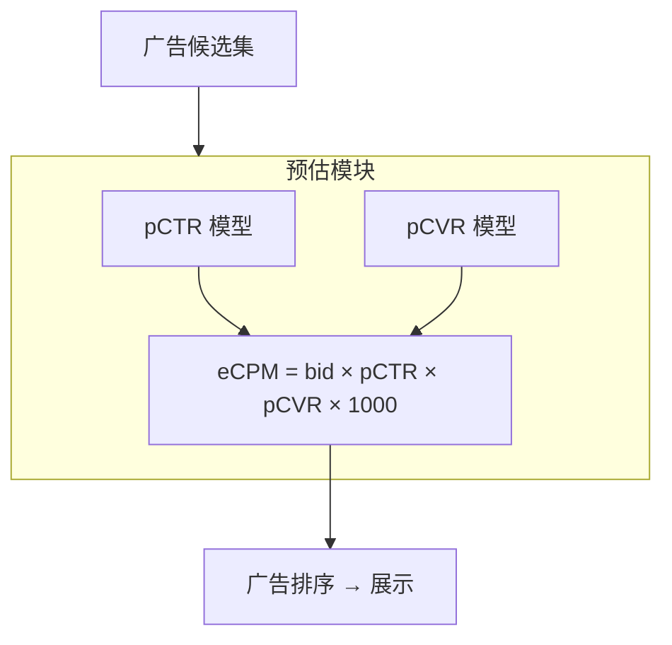
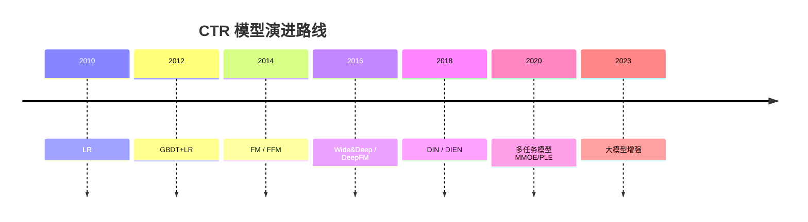
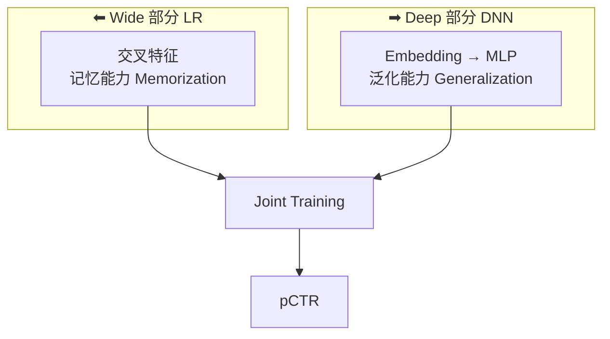
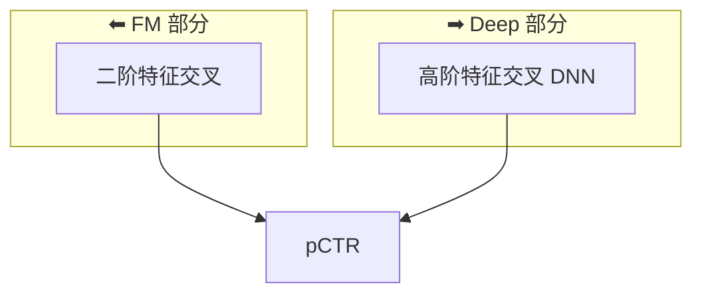
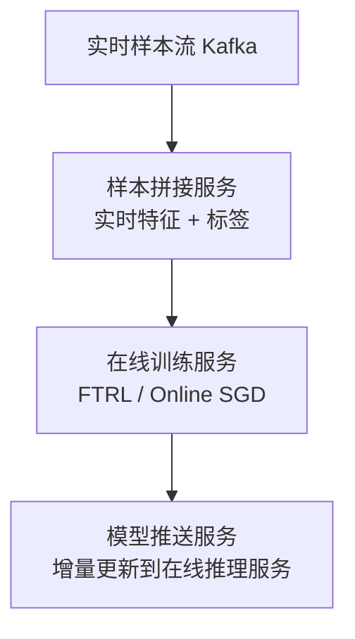
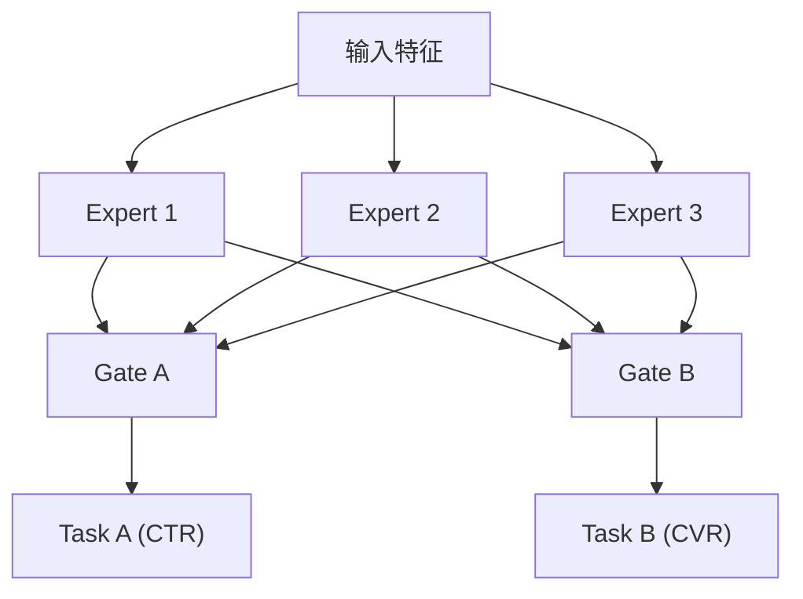

# CTR/CVR 预估

## 一句话概述

CTR (点击率) 和 CVR (转化率) 预估是广告系统的核心算法，直接决定广告排序和收入，模型从 LR 演进到深度学习，经历了特征工程驱动到端到端学习的范式转变。

---

## 预估在广告系统中的位置



---

## 模型演进路线



---

## 经典模型详解

### 1. LR (Logistic Regression)

```
模型: y = σ(w₀ + Σ wᵢxᵢ)
     σ(z) = 1 / (1 + e⁻ᶻ)

优点:
  - 简单高效，可解释性强
  - 训练和推理速度快
  - 支持在线学习
  - 工业界长期使用的 baseline

缺点:
  - 无法自动学习特征交叉
  - 需要大量人工特征工程
  - 表达能力有限

特征工程示例:
  原始特征: 用户年龄=25, 广告类别=游戏
  交叉特征: 年龄25×游戏 = 1 (需人工构造)
```

### 2. GBDT + LR (Facebook, 2014)

```
架构:
  原始特征 → GBDT → 叶子节点编码 → LR → pCTR

原理:
  GBDT 自动学习特征组合和非线性变换
  叶子节点编码作为 LR 的输入特征

示例:
  GBDT 有 100 棵树，每棵树 64 个叶子
  → 生成 100 × 64 = 6400 维 one-hot 特征
  → 输入 LR 进行最终预测

优点: 自动化特征交叉，效果显著提升
缺点: 两阶段训练，GBDT 无法在线更新
```

### 3. FM (Factorization Machine)

```
模型: y = w₀ + Σ wᵢxᵢ + Σᵢ Σⱼ <vᵢ, vⱼ> xᵢxⱼ

核心思想:
  每个特征学习一个 k 维隐向量 vᵢ
  特征交叉通过隐向量内积实现: <vᵢ, vⱼ>

优点:
  - 自动学习二阶特征交叉
  - 参数量 O(nk)，远小于显式交叉 O(n²)
  - 对稀疏特征友好

计算优化:
  Σᵢ Σⱼ <vᵢ, vⱼ> xᵢxⱼ 
  = 1/2 (‖Σ vᵢxᵢ‖² - Σ ‖vᵢ‖²xᵢ²)
  复杂度从 O(kn²) 降到 O(kn)
```

### 4. FFM (Field-aware FM)

```
改进: 每个特征对不同 field 学习不同的隐向量

FM:  <vᵢ, vⱼ>
FFM: <vᵢ,fⱼ, vⱼ,fᵢ>  (field-aware)

示例:
  特征: 用户性别(field1)=男, 广告类别(field2)=游戏, 时段(field3)=晚上
  FM:  v_男 · v_游戏 + v_男 · v_晚上 + v_游戏 · v_晚上
  FFM: v_男,f2 · v_游戏,f1 + v_男,f3 · v_晚上,f1 + v_游戏,f3 · v_晚上,f2

优点: 更精细的特征交叉
缺点: 参数量增大 O(nkf)
```

### 5. Wide & Deep (Google, 2016)



### 6. DeepFM (2017)



改进: 用 FM 替代 Wide 部分
优点:

- 不需要人工构造交叉特征
- FM 和 Deep 共享 Embedding
- 端到端训练

### 7. DIN (Deep Interest Network, 阿里, 2018)

```
核心思想: 用户兴趣是多样的，不同广告应该关注用户不同的历史行为

架构:
  用户历史行为序列: [商品A, 商品B, 商品C, 商品D, ...]
  候选广告: 广告X
  
  Attention 机制:
    对每个历史行为，计算与候选广告的相关性权重
    商品A 与广告X 的相关性: 0.1
    商品B 与广告X 的相关性: 0.8  ← 高相关
    商品C 与广告X 的相关性: 0.05
    商品D 与广告X 的相关性: 0.7  ← 高相关
    
  加权求和 → 用户对广告X的兴趣表示

关键创新:
  - Attention 机制捕获用户兴趣的多样性
  - 不同广告激活用户不同的兴趣点
  - 比简单的 mean/sum pooling 更精准
```

### 8. DIEN (Deep Interest Evolution Network, 阿里, 2019)

```
改进: 在 DIN 基础上建模兴趣的演化过程

架构:
  用户行为序列 → GRU (兴趣提取) → AUGRU (兴趣演化) → 兴趣表示
  
  兴趣提取层: GRU 捕获行为序列的时序关系
  兴趣演化层: 结合 Attention 的 GRU，建模与目标广告相关的兴趣演化

关键创新:
  - 建模用户兴趣随时间的变化
  - 辅助 loss 增强兴趣提取
```

---

## 特征工程

### 特征分类

| 类别 | 示例 | 特点 |
|------|------|------|
| **用户特征** | 年龄、性别、兴趣标签、历史行为 | 刻画用户 |
| **广告特征** | 广告主、行业、创意类型、历史CTR | 刻画广告 |
| **上下文特征** | 时间、地域、设备、网络、广告位 | 刻画场景 |
| **交叉特征** | 用户×广告主历史交互、用户×行业偏好 | 刻画关系 |
| **序列特征** | 用户最近点击的广告序列 | 刻画时序 |

### 特征处理

```
数值特征:
  - 归一化: (x - mean) / std
  - 分桶: 连续值 → 离散区间 (如年龄 → [18-24, 25-34, ...])
  - 对数变换: log(1 + x)

类别特征:
  - One-hot 编码
  - Embedding (高维稀疏 → 低维稠密)
  - Hash 编码 (超大规模类别特征)

序列特征:
  - Pooling (mean/sum/max)
  - Attention 加权
  - RNN/Transformer 编码
```

---

## 样本工程

### 正负样本定义

```
CTR 模型:
  正样本: 用户点击了广告
  负样本: 用户看到但没点击广告

CVR 模型:
  正样本: 用户点击后完成了转化
  负样本: 用户点击后没有转化

问题: 样本选择偏差 (Sample Selection Bias)
  CVR 模型只能在点击样本上训练
  但推理时需要对所有曝光样本预估
```

### 样本偏差与解决方案

#### ESMM (Entire Space Multi-Task Model, 阿里)

```
解决 CVR 样本选择偏差:

传统方式: CVR 模型在点击样本上训练 (有偏)
ESMM: 在全量曝光样本上训练

pCTCVR = pCTR × pCVR

  曝光样本 → pCTR 任务 (全量样本)
  曝光样本 → pCTCVR 任务 (全量样本)
  pCVR = pCTCVR / pCTR (隐式学习)
```

### 延迟转化 (Delayed Conversion)

```
问题: 用户点击广告后，可能过几天才转化
  点击时间: Day 1
  转化时间: Day 3
  
  如果 Day 1 就生成样本 → 误标为负样本

解决方案:
  1. 延迟标注: 等待归因窗口结束后再标注
     缺点: 样本时效性差
  
  2. 正样本回补: 先标为负样本，转化后修正为正样本
     需要模型支持样本更新
  
  3. 重要性采样: 对延迟转化进行概率建模
```

### 样本加权

```
场景: 不同位置的曝光价值不同
  首位广告: 曝光价值高 → 权重 1.0
  末位广告: 曝光价值低 → 权重 0.5

场景: 正负样本不均衡
  正样本 (点击): 1%
  负样本 (未点击): 99%
  
  处理:
  - 负采样: 随机采样部分负样本
  - 加权: 正样本权重 × N
```

---

## 模型校准 (Calibration)

### 为什么需要校准？

```
模型输出的 pCTR 可能不等于真实 CTR:
  模型预估 pCTR = 5%
  实际 CTR = 3%
  → 模型过高估计

影响:
  eCPM = bid × pCTR × pCVR
  pCTR 不准 → eCPM 不准 → 排序不准 → 收入受损
```

### 校准方法

| 方法 | 说明 |
|------|------|
| **Platt Scaling** | 用 sigmoid 函数拟合: p_cal = σ(a × p_raw + b) |
| **Isotonic Regression** | 保序回归，非参数方法 |
| **分桶校准** | 按预估值分桶，桶内用真实比例校准 |
| **温度缩放** | p_cal = σ(logit(p_raw) / T) |

### 校准评估

```
可靠性图 (Reliability Diagram):
  X 轴: 模型预估概率 (分桶)
  Y 轴: 实际正样本比例
  
  理想情况: 对角线 (预估 = 实际)
  
  ECE (Expected Calibration Error):
    ECE = Σ (|桶内样本数/总样本数| × |桶内预估均值 - 桶内真实比例|)
```

---

## 在线学习 (Online Learning)

### 为什么需要在线学习？

```
离线训练:
  训练数据: 昨天的数据
  模型上线: 今天
  问题: 无法捕捉实时变化 (热点事件、季节变化)

在线学习:
  实时消费新样本，持续更新模型
  模型始终反映最新的数据分布
```

### FTRL (Follow The Regularized Leader)

```
Google 提出的在线学习算法，广泛用于广告 CTR 预估

特点:
  - 支持 L1 正则化 → 产生稀疏解 → 减少模型大小
  - 每来一个样本就更新一次
  - 适合超大规模稀疏特征

更新规则:
  w_{t+1} = argmin_w (Σ gᵢ·w + 1/2 Σ σᵢ·‖w‖² + λ₁‖w‖₁)
```

### 在线学习架构



---

## 多任务学习

### MMOE (Multi-gate Mixture-of-Experts)



Gate 输出: 各 Expert 的加权组合

- `Gate_A = softmax(W_A × input) → [0.5, 0.3, 0.2]`
- `Task_A 输入 = 0.5×E1 + 0.3×E2 + 0.2×E3`

### PLE (Progressive Layered Extraction)

```
改进 MMOE: 增加任务特有的 Expert

架构:
  共享 Expert + 任务A专有 Expert + 任务B专有 Expert
  → 多层渐进式提取
  → 减少任务间的负迁移 (Negative Transfer)
```

---

## 与大数据开发的关联

- **样本生成管道**: 从日志中提取训练样本 (曝光→点击→转化 join)
- **特征计算**: 离线/实时特征的计算和存储
- **训练数据管理**: 海量训练数据的存储和管理 (HDFS/对象存储)
- **在线样本流**: Kafka 实时样本流的构建
- **模型效果监控**: AUC/GAUC/校准度等指标的实时计算
- **A/B 实验数据**: 模型实验的分流和指标计算

---

## 面试高频问题

1. CTR 预估模型的演进路线？各模型的核心思想？
2. FM 的原理是什么？计算复杂度如何优化？
3. DIN 的核心创新是什么？
4. CVR 预估的样本选择偏差问题如何解决？(ESMM)
5. 什么是模型校准？为什么广告系统需要校准？
6. 在线学习和离线学习的区别？FTRL 的原理？
7. 多任务学习 (MMOE/PLE) 在广告中的应用？

---

## 推荐阅读

- **论文**:
  - [Wide & Deep Learning](https://arxiv.org/abs/1606.07792) — Google, 2016
  - [DeepFM](https://arxiv.org/abs/1703.04247) — Huawei, 2017
  - [DIN](https://arxiv.org/abs/1706.06978) — Alibaba, 2018
  - [DIEN](https://arxiv.org/abs/1809.03672) — Alibaba, 2019
  - [ESMM](https://arxiv.org/abs/1804.07931) — Alibaba, 2018
  - [MMOE](https://dl.acm.org/doi/10.1145/3219819.3220007) — Google, 2018
- **书籍**:
  - 《深度学习推荐系统》— 王喆
  - 《计算广告》第 12 章
