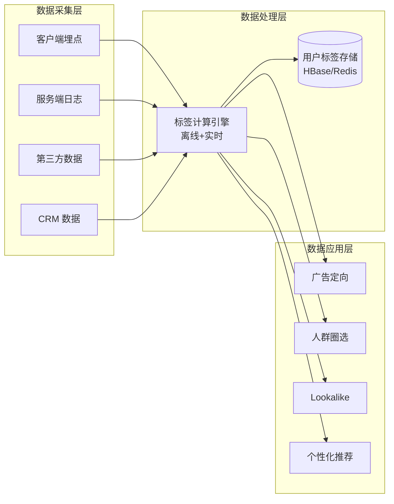
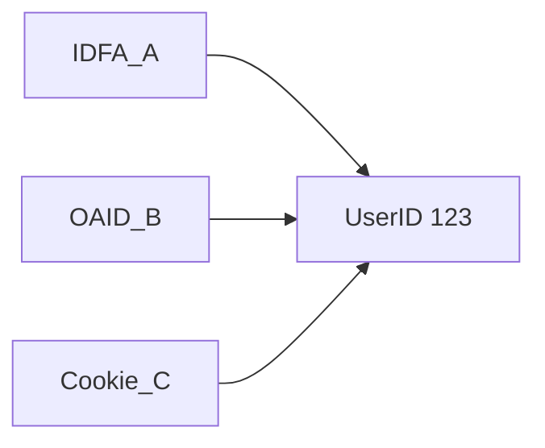
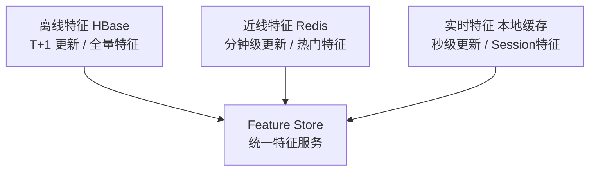

# 用户画像 (User Profile)

## 一句话概述

用户画像是广告精准投放的基础，通过采集和分析用户的基础属性、兴趣偏好、行为特征等多维数据，构建结构化的用户标签体系，实现"千人千面"的广告投放。

---

## 用户画像体系架构



---

## 用户标识体系 (User ID)

### 主要标识类型

| 标识 | 平台 | 特点 | 现状 |
|------|------|------|------|
| **IDFA** | iOS | Apple 广告标识符 | ATT 后获取率 ~20% |
| **GAID** | Android (海外) | Google 广告标识符 | 可重置 |
| **OAID** | Android (国内) | 移动安全联盟标准 | 国内安卓主流 |
| **IMEI** | Android | 设备硬件标识 | Android 10+ 限制获取 |
| **Cookie** | Web | 浏览器标识 | 第三方 Cookie 将淘汰 |
| **手机号** | 通用 | 用户注册信息 | 需用户授权，隐私敏感 |
| **UnionID** | 平台内 | 平台统一用户ID | 平台内跨应用打通 |

### ID Mapping (跨设备识别)

```
目标: 将同一用户在不同设备/平台上的标识关联起来

方法:
1. 确定性匹配 (Deterministic)
   - 登录账号关联: 同一账号在手机+平板+PC 登录
   - 手机号关联: 不同 App 使用同一手机号注册
   - 准确率: ~100%，但覆盖率低

2. 概率性匹配 (Probabilistic)
   - 基于设备特征相似度: IP + UA + 时间模式
   - 基于行为模式相似度: 浏览/搜索行为
   - 准确率: 60%–80%，覆盖率高



### 隐私时代的 ID 方案

| 方案 | 说明 |
|------|------|
| **第一方 ID** | 平台自有登录 ID，最可靠 |
| **UID 2.0** | 基于邮箱的加密标识 (The Trade Desk) |
| **Topics API** | Google 基于兴趣主题的匿名方案 |
| **CAID** | 中国广告协会互联网广告标识 |
| **设备指纹** | 基于设备特征的概率性标识 |

---

## 标签体系

### 标签分类

| 基础属性 | 兴趣偏好 | 行为特征 | 价值标签 |
|---------|---------|---------|--------|
| 年龄 | 兴趣分类 | 活跃度 | LTV |
| 性别 | 内容偏好 | 使用时长 | 付费能力 |
| 地域 | 品牌偏好 | 消费行为 | 流失风险 |
| 设备 | 价格敏感度 | 搜索行为 | 忠诚度 |
| 职业 | 风格偏好 | 社交行为 | |
| 学历 | | App使用 | |

### 标签层级

| 层级 | 示例 | 数量 |
|------|------|------|
| **一级标签** | 美妆、汽车、游戏、教育 | ~20 |
| **二级标签** | 护肤品、彩妆、美容仪器 | ~200 |
| **三级标签** | 面膜、精华液、防晒霜 | ~2000 |
| **四级标签** | 抗老精华、美白精华 | ~10000+ |

### 标签属性

```
标签定义:
{
  "tag_id": "interest_beauty_skincare",
  "tag_name": "护肤品",
  "category": "兴趣偏好",
  "level": 2,
  "parent": "interest_beauty",
  "score": 0.85,          // 置信度
  "source": "behavior",   // 来源
  "update_time": "2024-01-15",
  "ttl": "30d"            // 有效期
}
```

---

## 标签计算

### 离线标签计算

```
数据源 → ETL → 特征提取 → 标签计算 → 标签存储

典型流程 (Spark/Hive):
1. 用户行为日志 (浏览/搜索/点击/购买)
2. 按用户聚合行为数据 (最近 30 天)
3. 特征提取:
   - 浏览美妆内容次数 / 总浏览次数 = 美妆兴趣度
   - TF-IDF 提取关键词兴趣
   - 消费金额分位数 → 消费能力等级
4. 模型预测:
   - 年龄/性别预测 (分类模型)
   - 兴趣标签预测 (多标签分类)
5. 写入标签存储 (HBase/Redis)

更新频率: T+1 (每天更新)
```

### 实时标签计算

```
实时行为流 → Flink → 实时标签更新 → Redis

典型场景:
1. 用户刚搜索了"机票" → 实时打上"近期出行"标签
2. 用户刚浏览了汽车页面 → 实时更新"汽车兴趣"分数
3. 用户刚完成购买 → 实时更新"已转化"状态

Flink 处理逻辑:
  - 窗口聚合: 最近 1 小时行为统计
  - 规则触发: 特定行为触发标签更新
  - 模型推理: 在线模型实时预测
```

### 标签计算示例

#### 兴趣标签

```sql
-- Hive SQL: 计算用户兴趣标签
WITH user_behavior AS (
  SELECT
    user_id,
    content_category,
    COUNT(*) as view_cnt,
    SUM(stay_duration) as total_duration
  FROM user_view_log
  WHERE dt >= date_sub(current_date, 30)
  GROUP BY user_id, content_category
),
user_total AS (
  SELECT user_id, SUM(view_cnt) as total_cnt
  FROM user_behavior
  GROUP BY user_id
)
SELECT
  b.user_id,
  b.content_category as interest_tag,
  b.view_cnt / t.total_cnt as interest_score,
  b.total_duration
FROM user_behavior b
JOIN user_total t ON b.user_id = t.user_id
WHERE b.view_cnt / t.total_cnt > 0.1  -- 兴趣度阈值
```

#### 消费能力标签

```sql
-- 基于消费行为的消费能力分级
SELECT
  user_id,
  CASE
    WHEN avg_order_amount >= 500 THEN 'high'
    WHEN avg_order_amount >= 100 THEN 'medium'
    ELSE 'low'
  END as spending_level,
  NTILE(10) OVER (ORDER BY total_amount) as spending_decile
FROM (
  SELECT
    user_id,
    AVG(order_amount) as avg_order_amount,
    SUM(order_amount) as total_amount
  FROM order_log
  WHERE dt >= date_sub(current_date, 90)
  GROUP BY user_id
) t
```

---

## 特征工程 (Feature Engineering)

### 特征分类

| 类型 | 示例 | 存储 | 更新频率 |
|------|------|------|---------|
| **静态特征** | 年龄、性别、设备型号 | HBase | 低频 |
| **统计特征** | 7天点击次数、30天消费金额 | HBase | T+1 |
| **实时特征** | 最近1小时行为、当前session | Redis | 实时 |
| **交叉特征** | 用户×广告主历史交互 | 在线计算 | 实时 |

### 特征存储架构



---

## 人群圈选

### 基于标签的圈选

```
圈选条件:
  (年龄 IN [25-35]) 
  AND (性别 = 女) 
  AND (兴趣 CONTAINS '美妆') 
  AND (消费能力 IN ['high', 'medium'])
  AND (最近30天活跃)

预估覆盖: 1,200 万用户
```

### 基于行为的圈选

```
圈选条件:
  最近7天浏览过"面膜"相关内容 ≥ 3次
  AND 最近30天有电商购买行为
  AND 未购买过品牌X的产品

预估覆盖: 80 万用户
```

### 人群包技术实现

```
小规模人群 (< 100万):
  存储: HashSet / Redis Set
  查询: O(1) 精确匹配

中规模人群 (100万 - 1亿):
  存储: Bitmap (RoaringBitmap)
  查询: O(1)，支持交并差集运算
  空间: 1亿用户 ≈ 12MB

大规模人群 (> 1亿):
  存储: 分布式 Bitmap / Bloom Filter
  查询: Bloom Filter 有误判率 (可接受)
```

---

## 画像质量评估

### 评估指标

| 指标 | 说明 | 目标 |
|------|------|------|
| **覆盖率** | 有标签的用户占比 | > 80% |
| **准确率** | 标签预测的准确性 | > 75% |
| **时效性** | 标签更新的及时性 | 离线 T+1，实时秒级 |
| **一致性** | 不同来源标签的一致性 | > 90% |
| **区分度** | 标签对人群的区分能力 | 信息增益 > 阈值 |

### 标签准确率验证

```
方法1: 与真实数据对比
  预测性别 vs 注册性别 → 准确率

方法2: 广告效果验证
  使用标签定向的广告 CTR vs 随机投放 CTR
  提升越大 → 标签越有效

方法3: 人工抽样验证
  随机抽样用户，人工判断标签是否合理
```

---

## 与大数据开发的关联

- **数据采集**: 用户行为日志的采集和传输 (Kafka/Flume)
- **离线计算**: Spark/Hive 计算用户标签 (T+1)
- **实时计算**: Flink 实时更新用户标签
- **特征存储**: HBase/Redis 存储用户特征，Feature Store 建设
- **人群包计算**: Bitmap/Bloom Filter 的大规模人群包管理
- **ID Mapping**: 跨设备用户识别的数据处理
- **数据质量**: 标签覆盖率、准确率的监控和治理

---

## 面试高频问题

1. 用户画像系统的整体架构是怎样的？
2. 常见的用户标识有哪些？ID Mapping 如何实现？
3. 离线标签和实时标签的计算方式有什么区别？
4. 如何评估用户画像的质量？
5. 隐私保护对用户画像的影响？如何应对？
6. 人群包的技术实现方案？(Bitmap vs Bloom Filter)

---

## 推荐阅读

- 《用户画像：方法论与工程化解决方案》— 赵宏田
- 《计算广告》第 10 章 — 受众定向与画像
- [RoaringBitmap 文档](https://roaringbitmap.org/)
