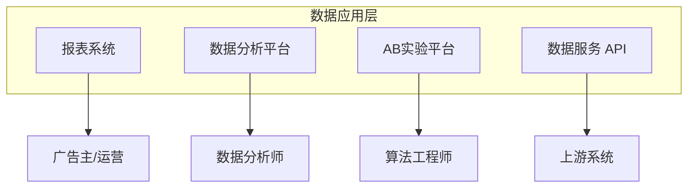
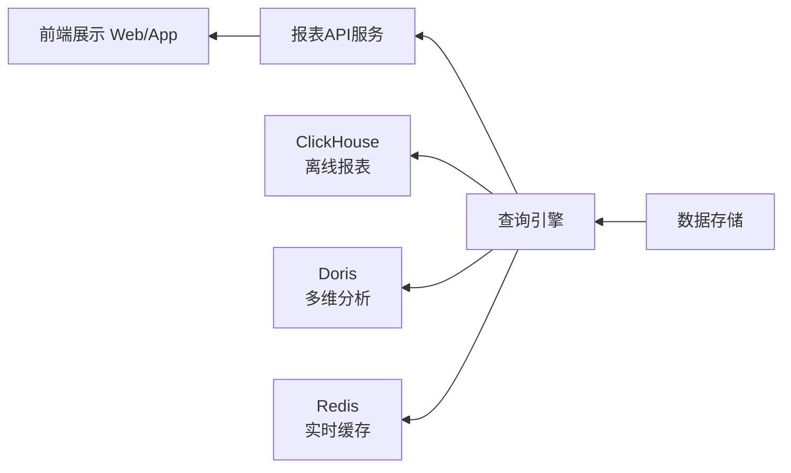
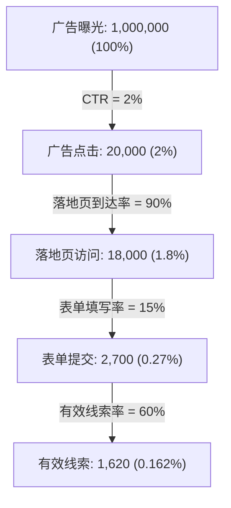

# 数据应用 (Data Application)

## 一句话概述

数据应用层是大数据平台面向业务的出口，将底层的数据能力封装为报表系统、数据分析工具、A/B 实验平台和数据服务 API，直接服务于广告主、运营和算法团队。

---

## 数据应用全景



---

## 报表系统

### 报表类型

| 报表 | 受众 | 数据源 | 时效性 |
|------|------|--------|--------|
| **广告主报表** | 广告主 | ADS 层 | T+1 / 实时 |
| **运营报表** | 内部运营 | DWS 层 | T+1 |
| **实时大盘** | 管理层/运营 | 实时计算 | 分钟级 |
| **财务报表** | 财务 | ADS 层 | T+1 |
| **算法效果报表** | 算法团队 | 实验平台 | T+1 |

### 广告主报表

广告主看到的报表 (日期: 2024-01-15, 账户: 品牌X):

| 推广计划 | 展示量 | 点击量 | 转化量 | 花费 | CPA |
|---------|--------|--------|--------|------|------|
| 计划A | 50,000 | 1,500 | 120 | ¥6000 | ¥50.00 |
| 计划B | 30,000 | 900 | 80 | ¥4000 | ¥50.00 |
| 计划C | 20,000 | 400 | 25 | ¥1500 | ¥60.00 |
| **合计** | **100,000** | **2,800** | **225** | **¥11500** | **¥51.11** |

支持维度: 时间 (日/周/月/小时级)、计划/单元/创意/关键词、地域/年龄/性别/设备、广告位/媒体

### 实时大盘

实时大盘展示示例 (2024-01-15 14:30):

| 指标 | 数值 | 变化 |
|------|------|------|
| **今日收入** | ¥12,345,678 | 目标完成 82.3% |
| **eCPM** | ¥32.5 | +5.2% |
| **CTR** | 2.3% | -0.1% |
| **填充率** | 85.2% | +1.3% |
| **QPS** | 125,000 | — |

技术方案: Flink 实时计算 → ClickHouse，前端 Grafana / 自研大盘，每分钟自动刷新

### 报表技术架构



优化手段: 预聚合、Redis 缓存热门查询、ClickHouse 物化视图、大查询异步执行

---

## 数据分析

### 多维分析 (OLAP)

```
分析场景:
  "上周游戏行业在 iOS 端的 eCPM 下降了 10%，
   按城市维度下钻，发现北京和上海下降最多，
   进一步按广告位分析，发现开屏广告位 eCPM 下降 20%"

操作:
  - 切片 (Slice): 固定某个维度值
  - 切块 (Dice): 固定多个维度值
  - 下钻 (Drill-down): 从粗粒度到细粒度
  - 上卷 (Roll-up): 从细粒度到粗粒度
  - 旋转 (Pivot): 交换行列维度
```

### 归因分析

```
问题: 用户在多个渠道看到广告后转化，功劳归谁？

多触点归因:
  用户路径: 抖音广告(曝光) → 百度搜索(点击) → 微信广告(点击) → 转化

  最后点击归因: 100% → 微信
  首次点击归因: 100% → 百度
  线性归因: 33% 抖音 + 33% 百度 + 33% 微信
  时间衰减: 10% 抖音 + 30% 百度 + 60% 微信
  数据驱动: 算法自动分配 (Shapley Value)
```

### 漏斗分析



优化方向: CTR 低→优化创意素材 / 落地页到达率低→优化页面加载速度 / 表单填写率低→优化落地页设计 / 有效线索率低→优化人群定向

---

## A/B 实验平台

### 为什么需要 A/B 实验？

```
广告系统的每一个改动都需要验证:
  - 新的 CTR 预估模型
  - 新的出价策略
  - 新的混排算法
  - 新的广告位设计
  - 新的定向策略

没有 A/B 实验 → 无法量化改动的效果 → 凭感觉决策
```

### 实验平台架构


- **实验管理**: 创建实验 (名称、假设、指标、时间)，配置实验组和对照组，设置流量比例
- **流量分配**: 用户级别分流，`bucket = hash(user_id + experiment_id) % 100`，分层实验互不干扰
- **指标计算**: 核心指标 (收入、CTR、CVR、CPA)，护栏指标 (留存、负反馈率)，显著性检验 (t-test / z-test / 贝叶斯)

### 分层实验

| 层级 | 实验分组 |
|------|----------|
| **全量用户流量** | |
| Layer 1: 召回层实验 | 实验A: 30% / 实验B: 30% / 对照: 40% |
| Layer 2: 排序层实验 | 实验C: 50% / 对照: 50% |
| Layer 3: 出价层实验 | 实验D: 20% / 实验E: 20% / 对照: 60% |

每层独立分流，互不干扰。用户可能同时参与多层的实验。

### 显著性检验

```
假设检验:
  H0 (原假设): 实验组和对照组没有差异
  H1 (备择假设): 实验组优于对照组

t-test:
  t = (X̄_exp - X̄_ctrl) / √(s²_exp/n_exp + s²_ctrl/n_ctrl)
  
  p-value < 0.05 → 拒绝 H0 → 差异显著
  p-value ≥ 0.05 → 不能拒绝 H0 → 差异不显著

实际操作:
  - 实验周期: 至少 7 天 (覆盖周末效应)
  - 样本量: 根据 MDE (最小可检测效应) 计算
  - 多重比较校正: Bonferroni / FDR
  - AA 实验: 验证分流的随机性
```

---

## 数据服务

### 数据 API

```
对外数据服务:
  1. 报表 API: 广告主查询投放数据
  2. 人群 API: 人群包上传/下载
  3. 转化 API: 转化数据回传
  4. 诊断 API: 投放问题诊断

API 设计:
GET /api/v1/report/campaign
  ?advertiser_id=12345
  &start_date=2024-01-01
  &end_date=2024-01-31
  &metrics=impressions,clicks,cost,ctr
  &dimensions=date,campaign_id
  &page=1&page_size=100

Response:
{
  "code": 0,
  "data": {
    "list": [...],
    "total": 150,
    "page": 1
  }
}
```

### 数据中台

数据中台能力:

| 数据资产管理 | 数据开发平台 | 数据治理 |
|-------------|-------------|----------|
| 元数据 | SQL IDE | 数据质量 |
| 数据目录 | 任务调度 | 数据安全 |
| 数据血缘 | 数据同步 | 权限管理 |
| 指标管理 | 数据服务 | 数据脱敏 |

---

## 与大数据开发的日常工作

- **报表开发**: 新报表需求的数据开发
- **数据分析支持**: 为分析师提供数据和工具
- **实验平台维护**: 实验分流和指标计算的开发
- **数据服务开发**: API 接口的开发和维护
- **数据治理**: 元数据管理、数据质量、权限控制

---

## 求职视角：岗位更关注哪些能力

如果方向切换为「大数据开发求职」，企业通常更关注你是否能把“数据系统能力”落到业务结果，而不仅是会用工具。

### 1) 数据链路稳定性与工程化能力（优先级最高）

- 能否设计并维护 **采集 → Kafka → Flink/Spark → 数仓/查询引擎 → 报表/API** 的完整链路
- 能否解释并实践 **幂等、重试、去重、对账、Exactly-Once、SLA 告警**
- 面试常问：数据延迟飙升、任务失败、口径不一致时怎么定位与止损

### 2) 指标与实验能力（直接关联业务价值）

- 能否定义核心指标（如 CTR/CVR/CPA/ROI）和护栏指标
- 能否做 **A/B 实验分流、显著性检验、实验复盘**，避免“只看上涨不看置信度”
- 这是“证明增量价值”的关键能力，很多团队比单纯 SQL 更看重

### 3) 实时数据处理与性能优化能力

- 是否具备 **分钟级甚至秒级** 数据处理经验（窗口、状态、Checkpoint、反压）
- 是否能做性能优化：热点 key、数据倾斜、资源配额、存储/查询加速
- 实战价值：预算控制、实时监控、异常告警都依赖这部分

### 4) 数据服务化与跨系统协作能力

- 是否能把数据能力产品化为 **稳定 API**（鉴权、分页、限流、缓存、版本管理）
- 是否有平台对接经验（上游埋点、下游报表、第三方回传）
- 企业会看你能不能作为“中间层”把业务、算法、产品串起来

### 5) 数据治理、风控与合规意识

- 是否关注 **口径统一、血缘、权限、脱敏、审计**
- 是否具备基础风控意识：异常流量识别、数据可信度校验、留痕与追溯
- 在广告/增长类岗位里，这是“能否长期稳定上线”的分水岭

### 6) 业务理解与表达能力

- 不只讲技术选型，还能讲清：这个方案为什么带来业务收益
- 能把复杂问题拆成可交付项，并给出验收标准（时效、准确率、成本）
- 面试官通常会通过项目追问来判断你是否真正“对业务负责”

### 求职准备建议（按投入产出排序）

1. 先准备 1-2 个“端到端项目故事”（链路、指标、问题、优化、结果）。
2. 每个项目都补齐可量化结果（延迟下降、成本下降、准确率提升）。
3. 强化 Flink/Kafka/数仓分层与数据治理这三块高频问答。
4. 准备一套实验与增量评估答题模板（分流→指标→统计→结论→风险）。

### 在 AI Coding 背景下，岗位关注点的变化

- **门槛下移，但标准上移**：会写代码不再稀缺，企业更看重你是否能定义问题、验证结果、稳定上线。
- **从“写功能”转向“控质量”**：你需要能审查 AI 生成代码的正确性、性能与边界条件，而不是直接照搬。
- **从“单点开发”转向“系统交付”**：岗位更看重端到端交付能力（需求拆解、实现、监控、复盘）。
- **从“经验驱动”转向“数据驱动”**：所有优化都要回到指标与实验，能解释“为什么有效”。

### 按岗位分层（初级/中级/高级）能力要求对照表

| 维度 | 初级（0-2年） | 中级（2-5年） | 高级（5年+） |
|------|---------------|---------------|--------------|
| 数据开发基础 | 能完成 SQL 开发、离线任务编写、基础报表 | 能独立建设主题数仓（分层、建模、口径） | 能主导跨业务数据架构演进与技术选型 |
| 实时计算 | 会使用 Flink/Kafka 完成简单实时任务 | 能处理状态、窗口、反压、倾斜并做稳定性优化 | 能设计高可用实时体系与容量规划，保障 SLA |
| 工程质量与稳定性 | 知道幂等、重试、监控基础 | 能建设端到端对账、异常处理、自动告警闭环 | 能定义稳定性标准并推动全团队落地（SLO/SLA/值班机制） |
| AI Coding 使用能力 | 能用 AI 辅助脚手架、样板 SQL、单元测试草稿 | 能对 AI 产出做代码审查与性能修正，形成可复用模板 | 能建立团队级 AI 开发规范（提示词、评审清单、风险边界） |
| 业务与指标理解 | 能理解常用广告指标并完成口径实现 | 能设计实验并解释结果，支持业务决策 | 能把技术路线与业务目标绑定，主导增量增长项目 |
| 沟通协作 | 能按需求交付并同步进度 | 能跨产品/算法/运营协同推进项目 | 能跨团队协调资源、管理预期并承担结果责任 |
| 面试信号 | 代码与 SQL 基础扎实，项目叙述清晰 | 有复杂问题定位和优化案例，结果可量化 | 有平台化建设、团队影响力和业务结果闭环 |

### 求职实战附录：项目复盘与能力展示模板

#### A. 项目复盘卡模板（可直接复制）

```markdown
# 项目复盘卡（Project Review Card）

## 0) 项目基本信息
- 项目名称：
- 时间周期：
- 业务场景：
- 我的角色：
- 协作方：

## 1) 业务目标（Why）
- 背景问题：
- 目标指标（最多 3 个）：
  - 指标1：基线 -> 目标
  - 指标2：基线 -> 目标
  - 指标3：基线 -> 目标
- 业务约束（时效/成本/合规/资源）：

## 2) 系统方案（What）
- 全链路：采集 -> 传输 -> 计算 -> 存储 -> 服务
- 关键模块：
  1.
  2.
  3.
- 关键取舍（Trade-off）：
  - 方案A为何选
  - 方案B为何不选
  - 风险与兜底

## 3) 执行落地（How）
- 里程碑：M1 / M2 / M3
- 我主导的动作：
  - 动作1
  - 动作2
  - 动作3
- AI Coding 使用（可选）：
  - 使用环节：
  - 审查方式（正确性/性能/边界）：
  - 复用沉淀（模板/脚本/检查清单）：

## 4) 问题与修复（Risk & Incident）
- 问题现象：
- 影响范围：
- 定位路径：
- 止损动作：
- 根因：
- 永久修复：
- 防复发机制：

## 5) 结果与收益（Impact）
- 量化结果（至少 2 个）：
  - 延迟：A -> B
  - 成本：A -> B
  - 稳定性：A -> B
  - 业务指标：A -> B
- 非量化收益：
  - 协作效率：
  - 工程规范：

## 6) 可复用沉淀（Reuse）
- 模板：
- SOP：
- 监控告警：
- 可复用边界：

## 7) 面试表达版（60秒）
- 背景：
- 目标：
- 我做了什么：
- 结果（数字）：
- 可复用价值：
```

#### B. 简历项目描述模板（结果导向）

- 模板 1：在【业务场景】下，负责【链路/模块】设计与落地，解决【关键难点】，通过【动作1/动作2】将【指标】从【A】提升到【B】（【提升比例】），并沉淀【模板/SOP】支撑后续复用。
- 模板 2：主导【稳定性治理主题】，建立【对账/幂等/告警/回滚】机制，将【失败率/延迟/异常发现时长】从【A】降到【B】，保障【SLA】并降低【人工成本】。
- 模板 3：围绕【业务目标】搭建【指标体系+实验机制】，负责【分流/统计/复盘】全流程，最终推动【核心业务指标】提升【x%】。

#### C. 面试 3 分钟表达模板（建议顺序）

1. 背景与目标（20%）：业务问题是什么，目标是什么。
2. 职责边界（20%）：你负责哪一段，拍板了什么。
3. 方案与取舍（30%）：为什么这么设计，替代方案为何不选。
4. 风险与修复（15%）：遇到什么问题，如何止损和复盘。
5. 结果与沉淀（15%）：量化结果 + 可复用资产。

#### D. 已填好示例（广告实时链路）

**项目名**：广告实时预算与报表一致性治理

- 背景：投放高峰期出现预算短时超支、报表分钟级延迟波动大。
- 目标：
  - 端到端延迟 P95 从 90s 降到 15s；
  - 预算超支率下降 30%；
  - 异常发现时长从 2h 缩短到 10min。
- 方案：Kafka + Flink 状态作业 + ClickHouse + 对账任务 + 告警中心。
- 我的动作：
  1. 设计热点 key 打散与两阶段聚合，缓解数据倾斜；
  2. 建立“投放侧消耗 vs 计费侧扣费”小时级对账；
  3. 建立延迟/丢数/重复三类告警与值班 SOP。
- 结果：
  - 延迟 P95：90s -> 12s；
  - 预算超支率：-37%；
  - 线上 P1 事故月均：3 次 -> 1 次。
- 沉淀：
  - 一套 Flink 实时作业检查清单（状态、反压、Checkpoint）；
  - 一套对账 SQL 模板和异常分级 SOP。

---

## 面试高频问题

1. 广告报表系统的技术架构是怎样的？
2. A/B 实验平台的核心组件有哪些？分层实验如何设计？
3. 如何判断一个实验结果是否显著？
4. 多维分析 (OLAP) 的常见操作有哪些？
5. 数据服务 API 如何设计？如何保证性能？

---

## 推荐阅读

- 《数据驱动：从方法到实践》
- 《A/B 测试：创新始于试验》
- [Google Optimize 文档](https://optimize.google.com/)
- [Apache Superset](https://superset.apache.org/) — 开源 BI 工具
