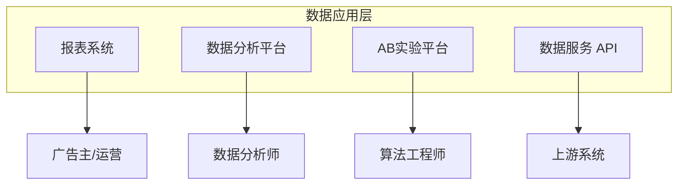
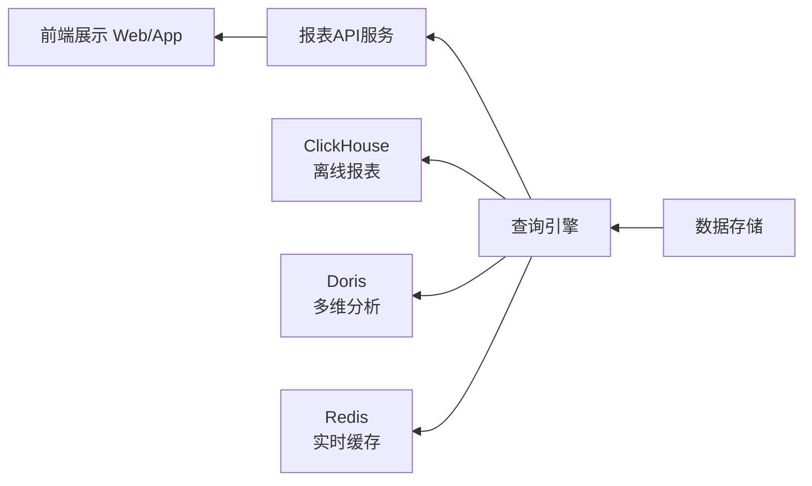
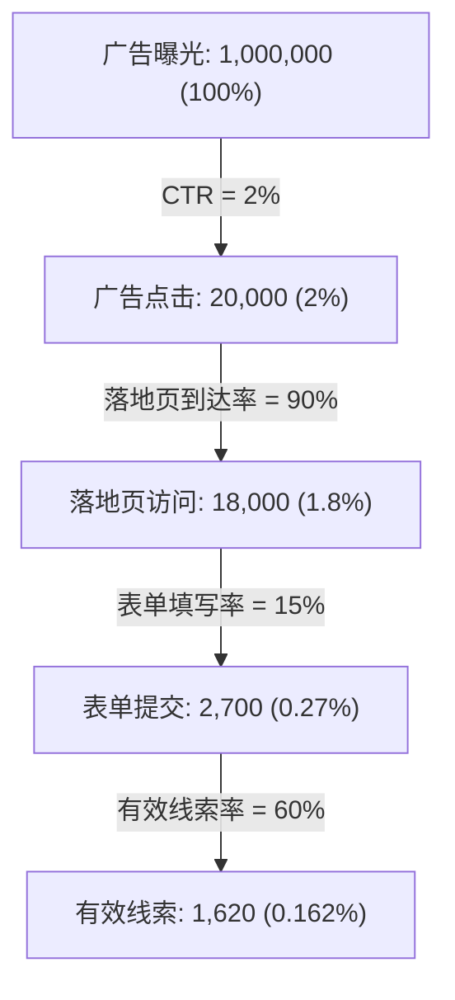

# 数据应用 (Data Application)

## 一句话概述

数据应用层是大数据平台面向业务的出口，将底层的数据能力封装为报表系统、数据分析工具、A/B 实验平台和数据服务 API，直接服务于广告主、运营和算法团队。

---

## 数据应用全景



---

## 报表系统

### 报表类型

| 报表 | 受众 | 数据源 | 时效性 |
|------|------|--------|--------|
| **广告主报表** | 广告主 | ADS 层 | T+1 / 实时 |
| **运营报表** | 内部运营 | DWS 层 | T+1 |
| **实时大盘** | 管理层/运营 | 实时计算 | 分钟级 |
| **财务报表** | 财务 | ADS 层 | T+1 |
| **算法效果报表** | 算法团队 | 实验平台 | T+1 |

### 广告主报表

广告主看到的报表 (日期: 2024-01-15, 账户: 品牌X):

| 推广计划 | 展示量 | 点击量 | 转化量 | 花费 | CPA |
|---------|--------|--------|--------|------|------|
| 计划A | 50,000 | 1,500 | 120 | ¥6000 | ¥50.00 |
| 计划B | 30,000 | 900 | 80 | ¥4000 | ¥50.00 |
| 计划C | 20,000 | 400 | 25 | ¥1500 | ¥60.00 |
| **合计** | **100,000** | **2,800** | **225** | **¥11500** | **¥51.11** |

支持维度: 时间 (日/周/月/小时级)、计划/单元/创意/关键词、地域/年龄/性别/设备、广告位/媒体

### 实时大盘

实时大盘展示示例 (2024-01-15 14:30):

| 指标 | 数值 | 变化 |
|------|------|------|
| **今日收入** | ¥12,345,678 | 目标完成 82.3% |
| **eCPM** | ¥32.5 | +5.2% |
| **CTR** | 2.3% | -0.1% |
| **填充率** | 85.2% | +1.3% |
| **QPS** | 125,000 | — |

技术方案: Flink 实时计算 → ClickHouse，前端 Grafana / 自研大盘，每分钟自动刷新

### 报表技术架构



优化手段: 预聚合、Redis 缓存热门查询、ClickHouse 物化视图、大查询异步执行

---

## 数据分析

### 多维分析 (OLAP)

```
分析场景:
  "上周游戏行业在 iOS 端的 eCPM 下降了 10%，
   按城市维度下钻，发现北京和上海下降最多，
   进一步按广告位分析，发现开屏广告位 eCPM 下降 20%"

操作:
  - 切片 (Slice): 固定某个维度值
  - 切块 (Dice): 固定多个维度值
  - 下钻 (Drill-down): 从粗粒度到细粒度
  - 上卷 (Roll-up): 从细粒度到粗粒度
  - 旋转 (Pivot): 交换行列维度
```

### 归因分析

```
问题: 用户在多个渠道看到广告后转化，功劳归谁？

多触点归因:
  用户路径: 抖音广告(曝光) → 百度搜索(点击) → 微信广告(点击) → 转化

  最后点击归因: 100% → 微信
  首次点击归因: 100% → 百度
  线性归因: 33% 抖音 + 33% 百度 + 33% 微信
  时间衰减: 10% 抖音 + 30% 百度 + 60% 微信
  数据驱动: 算法自动分配 (Shapley Value)
```

### 漏斗分析



优化方向: CTR 低→优化创意素材 / 落地页到达率低→优化页面加载速度 / 表单填写率低→优化落地页设计 / 有效线索率低→优化人群定向

---

## A/B 实验平台

### 为什么需要 A/B 实验？

```
广告系统的每一个改动都需要验证:
  - 新的 CTR 预估模型
  - 新的出价策略
  - 新的混排算法
  - 新的广告位设计
  - 新的定向策略

没有 A/B 实验 → 无法量化改动的效果 → 凭感觉决策
```

### 实验平台架构


- **实验管理**: 创建实验 (名称、假设、指标、时间)，配置实验组和对照组，设置流量比例
- **流量分配**: 用户级别分流，`bucket = hash(user_id + experiment_id) % 100`，分层实验互不干扰
- **指标计算**: 核心指标 (收入、CTR、CVR、CPA)，护栏指标 (留存、负反馈率)，显著性检验 (t-test / z-test / 贝叶斯)

### 分层实验

| 层级 | 实验分组 |
|------|----------|
| **全量用户流量** | |
| Layer 1: 召回层实验 | 实验A: 30% / 实验B: 30% / 对照: 40% |
| Layer 2: 排序层实验 | 实验C: 50% / 对照: 50% |
| Layer 3: 出价层实验 | 实验D: 20% / 实验E: 20% / 对照: 60% |

每层独立分流，互不干扰。用户可能同时参与多层的实验。

### 显著性检验

```
假设检验:
  H0 (原假设): 实验组和对照组没有差异
  H1 (备择假设): 实验组优于对照组

t-test:
  t = (X̄_exp - X̄_ctrl) / √(s²_exp/n_exp + s²_ctrl/n_ctrl)
  
  p-value < 0.05 → 拒绝 H0 → 差异显著
  p-value ≥ 0.05 → 不能拒绝 H0 → 差异不显著

实际操作:
  - 实验周期: 至少 7 天 (覆盖周末效应)
  - 样本量: 根据 MDE (最小可检测效应) 计算
  - 多重比较校正: Bonferroni / FDR
  - AA 实验: 验证分流的随机性
```

---

## 数据服务

### 数据 API

```
对外数据服务:
  1. 报表 API: 广告主查询投放数据
  2. 人群 API: 人群包上传/下载
  3. 转化 API: 转化数据回传
  4. 诊断 API: 投放问题诊断

API 设计:
GET /api/v1/report/campaign
  ?advertiser_id=12345
  &start_date=2024-01-01
  &end_date=2024-01-31
  &metrics=impressions,clicks,cost,ctr
  &dimensions=date,campaign_id
  &page=1&page_size=100

Response:
{
  "code": 0,
  "data": {
    "list": [...],
    "total": 150,
    "page": 1
  }
}
```

### 数据中台

数据中台能力:

| 数据资产管理 | 数据开发平台 | 数据治理 |
|-------------|-------------|----------|
| 元数据 | SQL IDE | 数据质量 |
| 数据目录 | 任务调度 | 数据安全 |
| 数据血缘 | 数据同步 | 权限管理 |
| 指标管理 | 数据服务 | 数据脱敏 |

---

## 与大数据开发的日常工作

- **报表开发**: 新报表需求的数据开发
- **数据分析支持**: 为分析师提供数据和工具
- **实验平台维护**: 实验分流和指标计算的开发
- **数据服务开发**: API 接口的开发和维护
- **数据治理**: 元数据管理、数据质量、权限控制

---

## 面试高频问题

1. 广告报表系统的技术架构是怎样的？
2. A/B 实验平台的核心组件有哪些？分层实验如何设计？
3. 如何判断一个实验结果是否显著？
4. 多维分析 (OLAP) 的常见操作有哪些？
5. 数据服务 API 如何设计？如何保证性能？

---

## 推荐阅读

- 《数据驱动：从方法到实践》
- 《A/B 测试：创新始于试验》
- [Google Optimize 文档](https://optimize.google.com/)
- [Apache Superset](https://superset.apache.org/) — 开源 BI 工具
