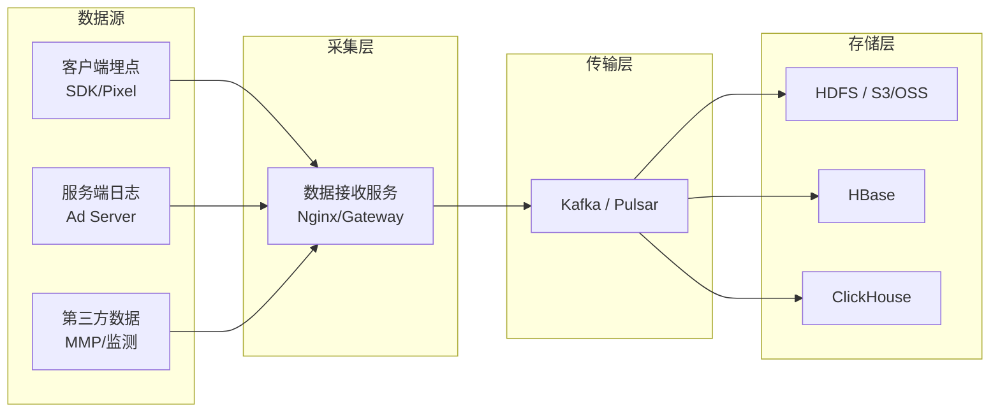

# 数据采集 (Data Collection)

## 一句话概述

数据采集是广告大数据系统的起点，负责将客户端埋点、服务端日志、第三方数据等多源数据实时可靠地传输到数据平台，是所有下游计算和分析的基础。

---

## 数据采集全景架构



---

## 客户端数据采集

### 广告 SDK 埋点

```
广告生命周期事件:
  1. ad_request    — 广告请求发出
  2. ad_fill       — 广告填充成功
  3. ad_show       — 广告展示 (曝光)
  4. ad_click      — 广告点击
  5. ad_close      — 广告关闭
  6. ad_video_start — 视频广告开始播放
  7. ad_video_25   — 播放到 25%
  8. ad_video_50   — 播放到 50%
  9. ad_video_75   — 播放到 75%
  10. ad_video_complete — 播放完成

每个事件包含:
{
  "event_type": "ad_show",
  "timestamp": 1705123456789,
  "request_id": "req_abc123",
  "ad_id": "ad_001",
  "creative_id": "cre_001",
  "ad_slot_id": "slot_banner_top",
  "device_id": "oaid_xxx",
  "os": "Android",
  "os_version": "13",
  "app_version": "5.2.1",
  "network": "WiFi",
  "ip": "1.2.3.4",
  "geo": {"lat": 31.23, "lng": 121.47},
  "session_id": "sess_xyz",
  "extra": {"viewable": true, "duration_ms": 1500}
}
```

### 埋点方案对比

| 方案 | 说明 | 优点 | 缺点 |
|------|------|------|------|
| **客户端 SDK** | App 内集成 SDK 上报 | 数据丰富、实时 | 需要发版、有丢失 |
| **Pixel (像素追踪)** | 1×1 透明图片请求 | 无需 SDK、Web 通用 | 数据有限 |
| **S2S (Server-to-Server)** | 服务端直接回传 | 可靠、不受客户端限制 | 延迟较高 |
| **JS SDK** | Web 页面 JS 代码 | Web 端通用 | 受浏览器限制 |

### Pixel 追踪原理

```html
<!-- 曝光追踪 Pixel -->


<!-- 点击追踪 (302 跳转) -->
用户点击广告 
  → https://track.ad-platform.com/click?req_id=abc123&ad_id=001
  → 302 重定向到广告落地页
  → https://www.advertiser.com/landing-page
```

### S2S 转化回传

```
广告主服务端 → 平台服务端

流程:
  1. 用户点击广告 → 平台记录 click_id
  2. 用户在广告主 App/网站完成转化
  3. 广告主服务端调用平台 API 回传转化

API 示例:
POST https://api.ad-platform.com/conversion
{
  "click_id": "clk_abc123",
  "event_type": "purchase",
  "event_time": 1705123456,
  "value": 199.00,
  "order_id": "order_xyz"
}

优势:
  - 不受客户端环境限制
  - 数据更可靠
  - 支持延迟转化
  - iOS ATT 后的主要归因方式
```

---

## 服务端日志采集

### 广告系统日志类型

| 日志类型 | 内容 | 量级 | 用途 |
|---------|------|------|------|
| **请求日志** | 每次广告请求的详细信息 | 最大 | 特征回溯、样本生成 |
| **召回日志** | 召回的候选广告列表 | 大 | 召回效果分析 |
| **排序日志** | 排序分数、特征值 | 大 | 模型调试、样本生成 |
| **竞价日志** | 出价、成交价、胜负 | 中 | 竞价分析 |
| **展示日志** | 实际展示的广告 | 中 | 计费、报表 |
| **点击日志** | 用户点击事件 | 小 | 计费、CTR 计算 |
| **转化日志** | 转化事件 | 最小 | 计费、CVR 计算 |

### 日志采集架构

```
方案1: 文件日志 + Agent 采集
  应用程序 → 写本地日志文件 → Filebeat/Flume Agent → Kafka

方案2: 直接写入消息队列
  应用程序 → Kafka Producer → Kafka

方案3: 日志服务
  应用程序 → HTTP/gRPC → 日志接收服务 → Kafka

推荐: 方案1 (最常用) 或 方案2 (低延迟)
```

### Flume 采集配置示例

```properties
# Flume Agent 配置
agent.sources = taildir-source
agent.channels = kafka-channel
agent.sinks = kafka-sink

# Source: 监控日志目录
agent.sources.taildir-source.type = TAILDIR
agent.sources.taildir-source.filegroups = f1
agent.sources.taildir-source.filegroups.f1 = /var/log/ad-server/request.*.log
agent.sources.taildir-source.positionFile = /var/flume/position.json

# Channel: Kafka Channel
agent.channels.kafka-channel.type = org.apache.flume.channel.kafka.KafkaChannel
agent.channels.kafka-channel.kafka.bootstrap.servers = kafka:9092
agent.channels.kafka-channel.kafka.topic = ad-request-log

# Sink: Kafka Sink
agent.sinks.kafka-sink.type = org.apache.flume.sink.kafka.KafkaSink
agent.sinks.kafka-sink.kafka.bootstrap.servers = kafka:9092
agent.sinks.kafka-sink.kafka.topic = ad-request-log
```

---

## 数据格式

### 常用序列化格式对比

| 格式 | 大小 | 速度 | 可读性 | Schema | 适用场景 |
|------|------|------|--------|--------|---------|
| **JSON** | 大 | 慢 | 好 | 无 | 调试、小数据量 |
| **Protobuf** | 小 | 快 | 差 | 强制 | 服务间通信、日志 |
| **Avro** | 小 | 快 | 差 | 内嵌 | Kafka、数据湖 |
| **Thrift** | 小 | 快 | 差 | 强制 | 服务间通信 |
| **ORC** | 最小 | 快 | 差 | 内嵌 | Hive 存储 |
| **Parquet** | 最小 | 快 | 差 | 内嵌 | Spark/数据湖 |

### Protobuf 日志定义示例

```protobuf
syntax = "proto3";

message AdRequestLog {
  string request_id = 1;
  int64 timestamp = 2;
  
  // 用户信息
  UserInfo user = 3;
  
  // 广告位信息
  AdSlotInfo ad_slot = 4;
  
  // 召回结果
  repeated AdCandidate candidates = 5;
  
  // 最终展示
  AdCandidate winner = 6;
  
  // 排序信息
  RankingInfo ranking = 7;
}

message UserInfo {
  string device_id = 1;
  string ip = 2;
  string ua = 3;
  GeoInfo geo = 4;
  map<string, float> features = 5;
}

message AdCandidate {
  int64 ad_id = 1;
  int64 creative_id = 2;
  float pctr = 3;
  float pcvr = 4;
  float bid = 5;
  float ecpm = 6;
}
```

---

## 数据接收服务

### 高性能数据接收

```
架构:
  客户端 → LB (负载均衡) → 数据接收服务集群 → Kafka

数据接收服务设计:
  - 语言: Go / C++ / Java
  - 协议: HTTP/gRPC
  - 异步写入: 接收后异步写入 Kafka
  - 批量写入: 攒批后批量发送
  - 本地缓存: Kafka 不可用时写本地磁盘

性能指标:
  - QPS: 10万+ / 单机
  - 延迟: < 10ms (P99)
  - 可用性: 99.99%
```

### 数据质量校验

```
接收时校验:
  1. 格式校验: JSON/Protobuf 格式是否合法
  2. 必填字段: request_id, timestamp, device_id 等
  3. 值域校验: timestamp 是否合理 (不能是未来时间)
  4. 签名校验: 防止数据伪造
  5. 去重: 基于 request_id 去重 (幂等)

异常处理:
  校验失败 → 写入死信队列 (Dead Letter Queue)
  → 后续人工排查或自动重试
```

---

## Kafka 在广告数据采集中的应用

### Topic 设计

```
Topic 命名规范: {业务}.{数据类型}.{来源}

广告系统 Topic:
  ads.request.server      — 广告请求日志
  ads.impression.client   — 客户端曝光日志
  ads.impression.server   — 服务端曝光日志
  ads.click.client        — 客户端点击日志
  ads.click.server        — 服务端点击日志
  ads.conversion.s2s      — S2S 转化日志
  ads.bid.server          — 竞价日志
  ads.feature.realtime    — 实时特征日志
```

### Kafka 配置建议

```
广告日志 Topic 配置:
  分区数: 根据消费者并行度设置 (通常 16-64)
  副本数: 3 (保证可靠性)
  保留时间: 7天 (热数据) / 30天 (冷数据)
  压缩: lz4 或 zstd (平衡压缩率和速度)
  
  # 高吞吐配置
  batch.size: 65536
  linger.ms: 5
  compression.type: lz4
  acks: 1 (高吞吐) 或 all (高可靠)
```

### 数据可靠性保障

```
端到端可靠性:
  客户端 → 本地缓存 → 批量上报 → 接收服务 → Kafka → 消费者

每个环节的保障:
  1. 客户端: 本地 SQLite 缓存，失败重试
  2. 接收服务: 异步写入 + 本地磁盘兜底
  3. Kafka: 多副本 + ISR 机制
  4. 消费者: offset 管理 + 幂等处理

数据丢失率目标: < 0.01%
```

---

## 数据采集监控

### 关键监控指标

| 指标 | 说明 | 告警阈值 |
|------|------|---------|
| **采集量** | 每分钟采集的消息数 | 环比下降 > 30% |
| **延迟** | 数据从产生到入 Kafka 的延迟 | P99 > 5s |
| **丢失率** | 客户端上报 vs 服务端接收的差异 | > 1% |
| **错误率** | 格式错误/校验失败的比例 | > 5% |
| **Kafka Lag** | 消费者消费延迟 | > 10万条 |
| **磁盘使用** | 日志磁盘使用率 | > 80% |

### 数据对账

```
三方对账:
  客户端上报量 vs 接收服务接收量 vs Kafka 消息量

对账 SQL 示例:
SELECT
  dt, hour,
  client_count,
  server_count,
  kafka_count,
  (client_count - server_count) / client_count as loss_rate
FROM (
  SELECT dt, hour, COUNT(*) as client_count
  FROM client_report_log GROUP BY dt, hour
) a
JOIN (
  SELECT dt, hour, COUNT(*) as server_count
  FROM server_receive_log GROUP BY dt, hour
) b ON a.dt = b.dt AND a.hour = b.hour
JOIN (
  SELECT dt, hour, COUNT(*) as kafka_count
  FROM kafka_message_log GROUP BY dt, hour
) c ON a.dt = c.dt AND a.hour = c.hour
```

---

## 与大数据开发的日常工作

- **埋点方案设计**: 与产品/客户端协作设计埋点方案
- **采集管道维护**: Flume/Filebeat/Kafka 集群的运维
- **数据质量治理**: 数据校验规则的制定和异常处理
- **数据对账**: 端到端数据一致性的监控和排查
- **新数据源接入**: 新业务/新广告位的数据接入
- **性能优化**: 采集链路的延迟和吞吐优化

---

## 面试高频问题

1. 广告数据采集的整体架构是怎样的？
2. 客户端埋点和服务端日志的区别？各自的优缺点？
3. 如何保证数据采集的可靠性？端到端不丢数据？
4. Kafka 在广告数据采集中的作用？如何配置？
5. 如何做数据采集的监控和对账？

---

## 推荐阅读

- 《Kafka 权威指南》
- 《数据密集型应用系统设计》(DERTA) 第 11 章
- [Flume 官方文档](https://flume.apache.org/)
