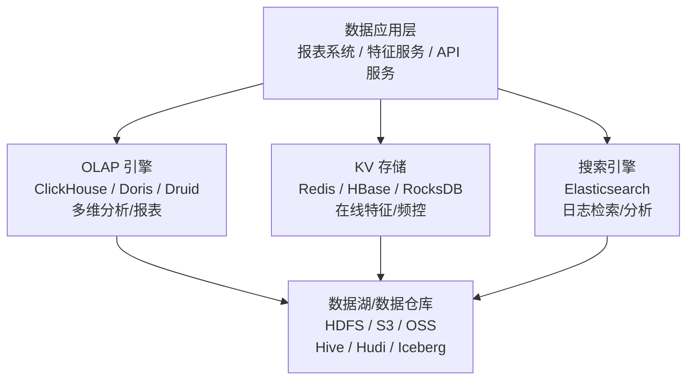
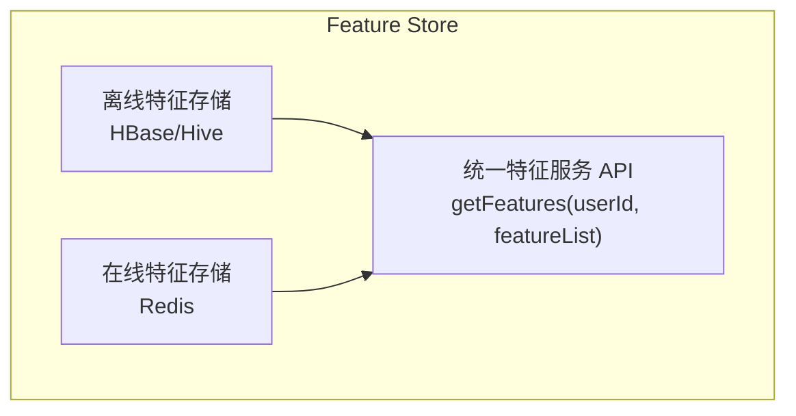

# 数据存储 (Data Storage)

## 一句话概述

广告系统的数据存储需要同时满足高吞吐写入、低延迟查询、海量数据分析等多种需求，通常采用多引擎组合架构：OLAP 引擎做分析、KV 存储做在线服务、数据湖做统一存储。

---

## 存储架构全景



---

## OLAP 引擎

### ClickHouse

| 特性 | 说明 |
|------|------|
| **类型** | 列式存储 OLAP 数据库 |
| **查询性能** | 单表聚合极快，亿级数据秒级响应 |
| **写入** | 批量写入高吞吐 |
| **压缩** | 列式存储 + LZ4/ZSTD，压缩比 10:1 |
| **分布式** | 支持分片 + 副本 |
| **SQL** | 兼容大部分 SQL 语法 |

**广告场景应用**:

```sql
-- 广告报表查询 (秒级响应)
SELECT
  campaign_id,
  sum(impressions) as imp,
  sum(clicks) as clk,
  sum(cost) as cost,
  clk / imp as ctr,
  cost / clk as cpc
FROM ad_report_daily
WHERE dt BETWEEN '2024-01-01' AND '2024-01-31'
  AND advertiser_id = 12345
GROUP BY campaign_id
ORDER BY cost DESC
LIMIT 100;

-- 实时大盘 (分钟级更新)
SELECT
  toStartOfMinute(event_time) as minute,
  count() as impressions,
  sumIf(1, event_type = 'click') as clicks,
  sum(cost) as revenue
FROM ad_events_realtime
WHERE event_time >= now() - INTERVAL 1 HOUR
GROUP BY minute
ORDER BY minute;
```

**ClickHouse 表引擎选择**:

| 引擎 | 适用场景 |
|------|---------|
| **MergeTree** | 基础引擎，支持主键排序 |
| **ReplacingMergeTree** | 去重场景 (按主键去重) |
| **SummingMergeTree** | 预聚合场景 (自动求和) |
| **AggregatingMergeTree** | 复杂预聚合 |
| **Distributed** | 分布式查询 |

```sql
-- 广告报表表设计
CREATE TABLE ad_report_daily ON CLUSTER cluster_1
(
  dt Date,
  advertiser_id UInt64,
  campaign_id UInt64,
  ad_slot_id String,
  os String,
  city String,
  impressions UInt64,
  clicks UInt64,
  conversions UInt64,
  cost Decimal(12, 2)
)
ENGINE = ReplicatedMergeTree('/clickhouse/tables/{shard}/ad_report', '{replica}')
PARTITION BY dt
ORDER BY (advertiser_id, campaign_id, ad_slot_id)
TTL dt + INTERVAL 180 DAY;
```

### Apache Doris / StarRocks

| 特性 | 说明 |
|------|------|
| **类型** | MPP 分析型数据库 |
| **优势** | MySQL 协议兼容、运维简单、实时导入 |
| **写入** | 支持实时写入 (Stream Load) |
| **查询** | 多表 Join 性能优于 ClickHouse |
| **适用** | 报表系统、Ad-hoc 查询 |

**Doris vs ClickHouse**:

| 维度 | ClickHouse | Doris/StarRocks |
|------|-----------|-----------------|
| **单表聚合** | 极快 | 快 |
| **多表 Join** | 较弱 | 强 |
| **实时写入** | 批量写入 | 实时写入 |
| **运维** | 复杂 | 简单 |
| **MySQL 兼容** | 不兼容 | 兼容 |
| **生态** | 全球广泛 | 国内增长快 |

### Apache Druid

| 特性 | 说明 |
|------|------|
| **类型** | 实时 OLAP 数据库 |
| **优势** | 亚秒级查询、实时摄入 |
| **适用** | 实时监控大盘、时序分析 |
| **劣势** | SQL 支持有限、运维复杂 |

---

## KV 存储

### Redis

**广告场景应用**:

| 场景 | Key 设计 | Value | TTL |
|------|---------|-------|-----|
| **用户特征** | `feat:{user_id}` | Hash (特征名→值) | 24h |
| **频次控制** | `freq:{user_id}:{ad_id}:{date}` | 计数器 | 24h |
| **预算余额** | `budget:{campaign_id}` | 剩余金额 | 持久 |
| **实时消耗** | `cost:{campaign_id}:{hour}` | 累计消耗 | 24h |
| **广告缓存** | `ad:{ad_id}` | 广告信息 JSON | 1h |
| **黑名单** | `blacklist:{type}` | Set (ID列表) | 持久 |

```
Redis 集群规模 (典型广告系统):
  - 节点数: 20-100+
  - 内存: 数百 GB ~ 数 TB
  - QPS: 百万级
  - 延迟: < 1ms (P99)
```

**Redis 数据结构选择**:

| 数据结构 | 适用场景 |
|---------|---------|
| **String** | 简单 KV、计数器 |
| **Hash** | 用户特征 (多字段) |
| **Set** | 人群包、黑名单 |
| **Sorted Set** | 排行榜、Top-N |
| **Bitmap** | 大规模人群包、布隆过滤器 |
| **HyperLogLog** | UV 去重计数 |

### HBase

**广告场景应用**:

| 场景 | RowKey 设计 | 说明 |
|------|------------|------|
| **用户画像** | `{user_id_reversed}` | 全量用户标签存储 |
| **行为序列** | `{user_id}_{timestamp}` | 用户历史行为 |
| **特征存储** | `{user_id}_{feature_group}` | 离线特征 |
| **日志存储** | `{date}_{request_id}` | 原始日志查询 |

```
HBase 适用场景:
  - 海量数据 (TB~PB 级)
  - 高吞吐写入
  - 按 Key 随机读取
  - 不需要复杂查询

不适用:
  - 复杂 SQL 查询
  - 多维分析
  - 低延迟要求 (< 1ms)
```

### RocksDB

```
嵌入式 KV 存储，常用于:
  - Flink State Backend
  - 本地特征缓存
  - 模型 Embedding 存储

优点: 高性能、低延迟、嵌入式
缺点: 单机存储、不支持分布式
```

---

## 特征存储 (Feature Store)

### 架构



- 离线特征: Spark 计算 → HBase/Hive (T+1)
- 在线特征: Flink 计算 → Redis (实时)
- 特征服务: 统一 API，自动路由到对应存储

### 特征一致性

```
问题: 训练时用离线特征，推理时用在线特征
     如果两者不一致 → 训练-推理偏差 (Training-Serving Skew)

解决:
  1. 特征日志: 推理时记录使用的特征值
  2. 训练时回放: 用推理时的特征值训练 (而非重新计算)
  3. 统一计算: 离线和在线使用相同的计算逻辑
```

---

## 数据湖

### Hudi / Iceberg / Delta Lake

| 特性 | Hudi | Iceberg | Delta Lake |
|------|------|---------|------------|
| **开发方** | Uber → Apache | Netflix → Apache | Databricks |
| **更新能力** | Copy-on-Write / Merge-on-Read | 支持 | 支持 |
| **时间旅行** | 支持 | 支持 | 支持 |
| **Schema 演进** | 支持 | 强 | 支持 |
| **生态** | Spark/Flink/Hive | Spark/Flink/Trino | Spark 为主 |
| **国内使用** | 广泛 | 增长中 | 较少 |

**广告场景应用**:

```
数据湖解决的问题:
  1. 数据更新: 广告日志需要延迟更新 (转化回传)
     传统 Hive: 不支持行级更新，需要全分区重写
     数据湖: 支持 UPSERT，只更新变化的行

  2. 实时入湖: 
     传统: Kafka → Flink → HDFS → Hive (小时级)
     数据湖: Kafka → Flink → Hudi/Iceberg (分钟级)

  3. 数据回溯:
     时间旅行功能，可以查询历史任意时间点的数据
```

---

## 存储选型指南

| 场景 | 推荐存储 | 原因 |
|------|---------|------|
| **广告报表** | ClickHouse / Doris | 多维聚合查询快 |
| **实时大盘** | ClickHouse / Druid | 亚秒级查询 |
| **用户特征 (在线)** | Redis | 低延迟 (<1ms) |
| **用户特征 (离线)** | HBase / Hive | 海量存储 |
| **频次控制** | Redis | 低延迟、原子操作 |
| **预算控制** | Redis | 低延迟、原子操作 |
| **日志存储** | HDFS / OSS + Hive | 海量、低成本 |
| **训练样本** | HDFS / OSS (Parquet) | 大文件、高吞吐 |
| **日志检索** | Elasticsearch | 全文检索 |
| **数据湖** | Hudi / Iceberg | 更新、时间旅行 |

---

## 存储成本优化

### 数据生命周期管理

```
热数据 (最近 7 天):
  存储: SSD / Redis / ClickHouse
  用途: 实时查询、在线服务

温数据 (7-90 天):
  存储: HDD / HDFS / ClickHouse (冷分区)
  用途: 报表查询、数据分析

冷数据 (90 天以上):
  存储: 对象存储 (OSS/S3) / 归档存储
  用途: 合规保留、历史回溯
  
策略:
  ClickHouse TTL: 自动删除过期数据
  HDFS 归档: 定期将旧数据迁移到低成本存储
  压缩: ORC/Parquet 列式存储 + ZSTD 压缩
```

### 存储压缩

```
原始 JSON 日志: 100 GB/天
  → Protobuf: 30 GB/天 (70% 压缩)
  → Parquet + ZSTD: 8 GB/天 (92% 压缩)
  → ClickHouse 列式: 5 GB/天 (95% 压缩)
```

---

## 与大数据开发的日常工作

- **存储选型**: 根据业务场景选择合适的存储引擎
- **表设计**: ClickHouse/HBase/Hive 表结构设计
- **数据导入**: ETL 数据写入各存储引擎
- **性能调优**: 查询优化、索引设计、分区策略
- **容量规划**: 存储容量预估和扩容
- **数据迁移**: 存储引擎升级或迁移
- **成本优化**: 数据生命周期管理、压缩优化

---

## 面试高频问题

1. ClickHouse 和 Doris 的区别？各自适用什么场景？
2. Redis 在广告系统中的应用场景有哪些？
3. Feature Store 的架构是怎样的？如何保证特征一致性？
4. 数据湖 (Hudi/Iceberg) 解决了什么问题？
5. 如何做存储成本优化？
6. HBase RowKey 如何设计？

---

## 推荐阅读

- 《ClickHouse 原理解析与应用实践》
- 《HBase 权威指南》
- [Apache Doris 官方文档](https://doris.apache.org/)
- [Apache Hudi 官方文档](https://hudi.apache.org/)
