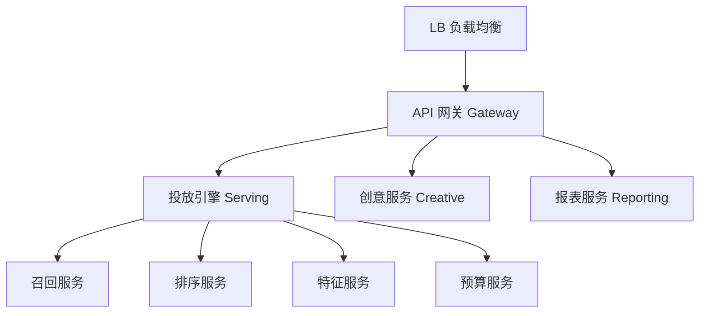
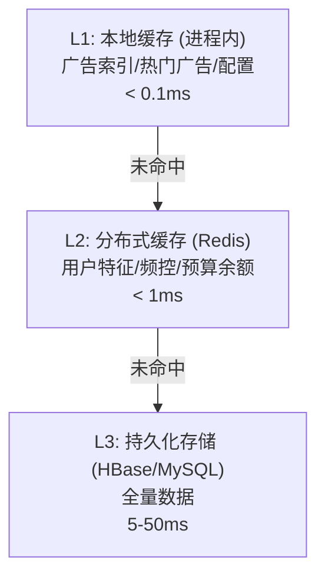
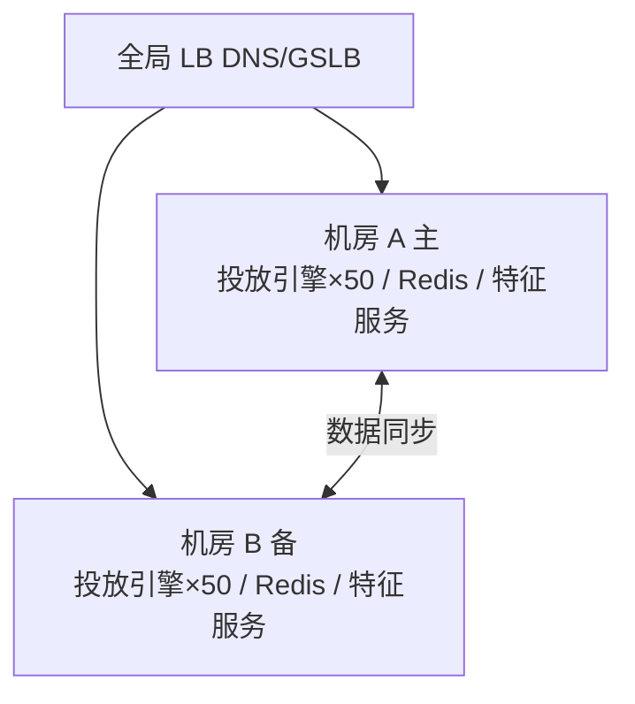

# 高性能广告系统 (High-Performance Ad System)

## 一句话概述

广告系统是互联网中对性能要求最苛刻的系统之一，需要在 100ms 内完成从请求接收到广告返回的全流程，同时支撑百万级 QPS，核心挑战是低延迟与高吞吐的兼顾。

---

## 性能要求

```
端到端延迟目标: < 100ms

时间预算分配:
  网络传输 (客户端→服务端):  ~10ms
  请求解析 + 用户识别:       ~5ms
  特征获取:                  ~10ms (并行)
  广告召回:                  ~10ms
  粗排:                      ~5ms
  精排 (模型推理):           ~15ms
  重排 + 机制:               ~5ms
  响应序列化:                ~3ms
  网络传输 (服务端→客户端):  ~10ms
  ─────────────────────────────
  总计:                      ~73ms (留有余量)

QPS 要求:
  头部广告平台: 百万级 QPS
  中型平台: 10万级 QPS
  每次请求可能触发 5-20 个下游调用
```

---

## 系统架构

### 微服务架构



### 服务间通信

| 方式 | 延迟 | 吞吐 | 适用场景 |
|------|------|------|---------|
| **gRPC** | 低 | 高 | 服务间同步调用 |
| **HTTP/2** | 中 | 中 | 对外 API |
| **Kafka** | 高 | 极高 | 异步消息 |
| **共享内存** | 极低 | 极高 | 同机服务 |

---

## 低延迟优化

### 1. 多级缓存



缓存命中率目标: L1 > 95%, L2 > 99%

### 2. 并行处理

```
串行处理 (慢):
  特征获取 (10ms) → 召回 (10ms) → 排序 (15ms) = 35ms

并行处理 (快):
  ┌─ 用户特征获取 (10ms) ─┐
  ├─ 广告特征获取 (8ms)  ─┤── 合并 → 排序 (15ms) = 25ms
  └─ 上下文特征 (2ms)   ─┘

实现:
  - Java: CompletableFuture / 线程池
  - Go: goroutine + channel
  - C++: std::async / 线程池
```

### 3. 预计算

```
离线预计算:
  - 广告倒排索引: 离线构建，在线加载
  - 用户 Embedding: 离线计算，在线查表
  - 广告质量分: 离线计算，定期更新

近线预计算:
  - 用户实时特征: Flink 计算，写入 Redis
  - 广告实时统计: 实时更新展示/点击计数
```

### 4. 模型推理优化

| 优化手段 | 说明 | 加速比 |
|---------|------|--------|
| **模型量化** | FP32 → INT8 | 2-4x |
| **模型剪枝** | 去除冗余参数 | 1.5-3x |
| **知识蒸馏** | 大模型 → 小模型 | 2-5x |
| **算子融合** | 合并连续算子 | 1.2-2x |
| **批量推理** | 多个请求合并推理 | 2-10x |
| **GPU 推理** | CPU → GPU | 5-20x |

```
模型推理框架:
  - TensorFlow Serving
  - TorchServe
  - NVIDIA Triton Inference Server
  - ONNX Runtime
  - TensorRT (NVIDIA GPU 优化)

批量推理 (Batching):
  单条推理: 1ms/条, 100 QPS → 100ms
  批量推理: 10条/批, 5ms/批 → 0.5ms/条, 2000 QPS
```

### 5. 网络优化

```
- 连接池: 复用 TCP 连接，避免频繁建连
- 长连接: gRPC 使用 HTTP/2 多路复用
- 就近部署: 服务部署在同一机房/机架
- 序列化: Protobuf 替代 JSON (体积小 3-5 倍)
- 压缩: gzip/snappy 压缩大响应体
```

---

## 高吞吐优化

### 水平扩展

```
无状态服务 → 水平扩展

投放引擎:
  单机 QPS: ~5,000
  目标 QPS: 500,000
  需要实例: ~100 台

自动扩缩容 (HPA):
  CPU > 70% → 扩容
  CPU < 30% → 缩容
  QPS 突增 → 快速扩容
```

### 异步处理

```
同步处理 (阻塞):
  请求 → 处理 → 等待下游响应 → 返回

异步处理 (非阻塞):
  请求 → 异步调用下游 → 处理其他请求 → 回调返回

非核心路径异步化:
  - 日志写入: 异步写入 Kafka
  - 计费扣费: 异步扣费 (允许短暂延迟)
  - 频控更新: 异步更新 Redis
  - 监控上报: 异步上报指标
```

### 资源隔离

```
线程池隔离:
  核心链路线程池: 专用，不被非核心任务抢占
  非核心线程池: 日志、监控等

进程隔离:
  投放引擎 和 报表服务 部署在不同机器
  避免报表查询影响投放性能

机房隔离:
  多机房部署，就近服务
  单机房故障不影响整体
```

---

## 内存优化

### 对象池 (Object Pool)

```
问题: 频繁创建/销毁对象 → GC 压力大

方案: 对象池复用对象
  - 请求对象池
  - 响应对象池
  - 连接池

Java 示例:
  GenericObjectPool<AdRequest> requestPool = new GenericObjectPool<>(factory);
  AdRequest req = requestPool.borrowObject();
  try {
    // 处理请求
  } finally {
    requestPool.returnObject(req);
  }
```

### 堆外内存 (Off-Heap)

```
场景: 广告索引数据量大 (GB 级)，放在 JVM 堆内会导致 GC 停顿

方案:
  - 使用堆外内存 (DirectByteBuffer / Unsafe)
  - 或使用 MMap 映射文件
  - 避免 GC 扫描大对象

工具:
  - Java: Netty ByteBuf / Chronicle Map
  - C++: 直接内存管理
```

### GC 优化 (Java)

```
广告系统 JVM 调优:
  - 使用 G1 或 ZGC (低停顿)
  - 堆大小: 根据业务设置 (通常 4-16GB)
  - 新生代比例: 适当增大 (减少 Minor GC)
  - 避免大对象直接进入老年代

ZGC 配置:
  -XX:+UseZGC
  -XX:MaxGCPauseMillis=5
  -Xmx16g -Xms16g

监控:
  - GC 频率和停顿时间
  - 堆内存使用率
  - Full GC 次数 (目标: 0)
```

---

## 高可用架构

### 多机房部署



策略: 同城双活 (两机房同时服务)、异地灾备 (主机房故障切换)、就近接入 (请求路由到最近机房)

### 超时与降级

```
超时策略:
  特征服务超时 (10ms):
    → 使用默认特征值
  排序服务超时 (20ms):
    → 使用粗排结果
  整体超时 (80ms):
    → 返回兜底广告 / 空广告

降级策略:
  Level 1: 关闭非核心特征 (减少特征获取时间)
  Level 2: 跳过精排，使用粗排结果
  Level 3: 跳过个性化，返回热门广告
  Level 4: 返回空广告 (保护系统)
```

---

## 性能监控

### 关键监控指标

| 指标 | 说明 | 告警阈值 |
|------|------|---------|
| **P50 延迟** | 中位数延迟 | < 30ms |
| **P99 延迟** | 99 分位延迟 | < 100ms |
| **P999 延迟** | 99.9 分位延迟 | < 200ms |
| **QPS** | 每秒请求数 | 监控趋势 |
| **错误率** | 5xx / 超时比例 | < 0.1% |
| **CPU 使用率** | 服务器 CPU | < 70% |
| **GC 停顿** | GC 暂停时间 | P99 < 10ms |

### 性能分析工具

| 工具 | 用途 |
|------|------|
| **火焰图 (Flame Graph)** | CPU 热点分析 |
| **JProfiler / async-profiler** | Java 性能分析 |
| **perf** | Linux 系统级性能分析 |
| **Jaeger / Zipkin** | 分布式链路追踪 |
| **Prometheus + Grafana** | 指标监控和可视化 |

---

## 与大数据开发的关联

- **特征服务性能**: 特征查询的延迟直接影响投放延迟
- **数据预处理**: 离线预计算减少在线计算量
- **缓存预热**: 数据变更时及时更新缓存
- **监控数据**: 性能指标的采集和分析
- **容量规划**: 基于数据量预估系统容量

---

## 面试高频问题

1. 广告系统如何做到 100ms 内响应？
2. 多级缓存的设计和一致性保证？
3. 模型推理如何优化延迟？
4. 系统高可用如何保障？降级策略有哪些？
5. 如何做性能监控和瓶颈定位？

---

## 推荐阅读

- 《高性能服务系统设计与实现》
- 《系统性能：企业与云》— Brendan Gregg
- [美团广告系统架构实践](https://tech.meituan.com/)
