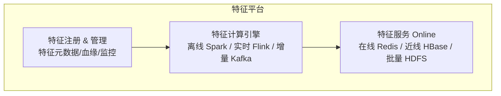
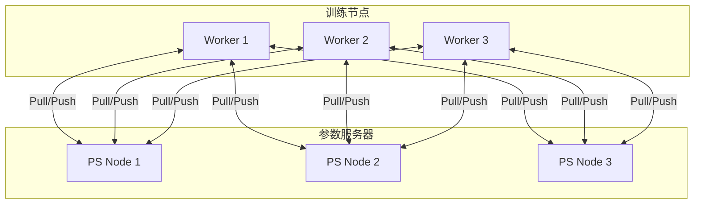
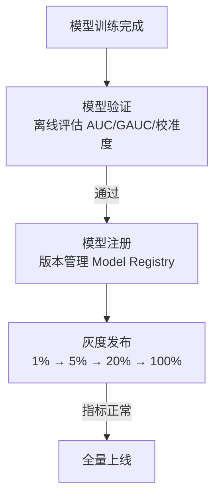

# 模型工程 (ML Engineering)

## 一句话概述

模型工程是连接算法研究与线上生产的桥梁，涵盖特征平台、分布式训练、模型部署、效果监控等环节，确保模型从离线实验到线上服务的高效流转。

---

## ML 工程全景


---

## 特征平台 (Feature Platform)

### 架构



### 特征注册与管理

```yaml
# 特征定义示例
feature:
  name: user_click_cnt_7d
  description: "用户最近7天点击广告次数"
  type: INT
  entity: user_id
  source: dwd_ad_click
  compute:
    engine: spark
    sql: |
      SELECT user_id, COUNT(*) as value
      FROM dwd_ad_click
      WHERE dt >= date_sub('${date}', 7)
      GROUP BY user_id
  storage:
    offline: hbase://feature_store/user_features
    online: redis://feature_cache
  schedule: daily
  owner: data-team
  tags: [user, behavior, click]
```

### 训练-推理一致性 (Training-Serving Consistency)

```
问题:
  训练时: 用离线计算的特征 (T+1)
  推理时: 用在线获取的特征 (实时)
  → 特征值可能不同 → 模型效果下降

解决方案:

方案1: 特征日志回放 (Feature Logging)
  推理时记录使用的特征值 → 训练时使用这些记录的值
  优点: 完全一致
  缺点: 存储成本高

方案2: 统一计算逻辑
  离线和在线使用相同的特征计算代码
  通过 Feature Store 统一管理

方案3: 特征快照
  定期将在线特征快照到离线存储
  训练时使用快照数据
```

---

## 样本生成

### 样本拼接流程

```
曝光日志 + 点击日志 + 转化日志 + 特征日志 → 训练样本

拼接逻辑:
  1. 曝光日志 LEFT JOIN 点击日志 (by request_id)
     → label_click = 1 if matched, else 0
  
  2. 点击日志 LEFT JOIN 转化日志 (by click_id, 归因窗口内)
     → label_convert = 1 if matched, else 0
  
  3. JOIN 特征日志 (by request_id)
     → 获取推理时使用的特征值

输出样本格式:
{
  "label_click": 1,
  "label_convert": 0,
  "features": {
    "user_age": 28,
    "user_gender": 1,
    "user_click_cnt_7d": 15,
    "ad_industry": "game",
    "ad_ctr_history": 0.025,
    "context_hour": 14,
    "context_os": "android"
  }
}
```

### 样本存储格式

| 格式 | 优点 | 缺点 | 适用 |
|------|------|------|------|
| **TFRecord** | TensorFlow 原生 | 仅 TF 生态 | TF 训练 |
| **Parquet** | 通用、压缩好 | 需要转换 | 通用存储 |
| **LibSVM** | 简单、通用 | 不支持复杂特征 | 传统 ML |
| **自定义二进制** | 最高效 | 维护成本 | 超大规模 |

---

## 分布式训练

### 参数服务器 (Parameter Server)



流程: Worker 从 PS 拉取参数 (Pull) → 用本地数据计算梯度 → 将梯度推送到 PS (Push) → PS 更新参数 → 重复

适用: 超大规模稀疏模型 (Embedding 参数量巨大)，工具: TensorFlow PS, PaddlePaddle, Angel

### 数据并行 (Data Parallelism)

```
架构:
  每个 Worker 持有完整模型副本
  数据分片到不同 Worker
  梯度通过 AllReduce 同步

  Worker 1 (数据分片1) ──┐
  Worker 2 (数据分片2) ──┼── AllReduce → 更新参数
  Worker 3 (数据分片3) ──┘

适用: 稠密模型 (DNN)
工具: Horovod, PyTorch DDP, DeepSpeed
```

### 广告模型训练特点

```
特点:
  1. 超大规模 Embedding: 特征维度可达亿级
     → 单机内存放不下 → 需要参数服务器
  
  2. 稀疏特征为主: 大量 one-hot/multi-hot 特征
     → 需要高效的稀疏梯度更新
  
  3. 数据量巨大: 每天数十亿样本
     → 需要分布式训练
  
  4. 时效性要求: 模型需要频繁更新 (小时级/天级)
     → 增量训练 + 全量训练结合

训练规模:
  样本量: 10亿+/天
  特征维度: 亿级
  Embedding 大小: 数百 GB
  训练时间: 数小时 (分布式)
  GPU/CPU: 数十到数百台
```

---

## 模型部署

### 部署流程



### 模型推理服务

| 框架 | 特点 | 适用 |
|------|------|------|
| **TF Serving** | TensorFlow 原生 | TF 模型 |
| **TorchServe** | PyTorch 原生 | PyTorch 模型 |
| **Triton** | NVIDIA，多框架支持 | GPU 推理 |
| **ONNX Runtime** | 跨框架 | 通用 |
| **自研推理引擎** | 极致优化 | 超大规模 |

### 模型更新策略

```
全量更新:
  每天重新训练完整模型 → 替换线上模型
  适用: 模型结构变化、特征变化

增量更新:
  基于昨天的模型，用今天的数据继续训练
  适用: 日常更新，保持时效性

实时更新 (Online Learning):
  实时消费样本，持续更新模型参数
  适用: 对时效性要求极高的场景

热更新 (Hot Swap):
  新模型加载到内存 → 原子切换 → 旧模型释放
  零停机时间
```

---

## 模型评估

### 离线评估指标

| 指标 | 说明 | 目标 |
|------|------|------|
| **AUC** | ROC 曲线下面积 | > 0.75 |
| **GAUC** | 分用户计算 AUC 再加权平均 | > 0.70 |
| **LogLoss** | 对数损失 | 越小越好 |
| **校准度** | 预估值与真实值的偏差 | 接近 1.0 |
| **NDCG** | 排序质量 | 越大越好 |

### GAUC (Group AUC)

```
为什么用 GAUC 而不是 AUC？

AUC: 全局计算，可能被高活跃用户主导
GAUC: 按用户分组计算 AUC，再加权平均

GAUC = Σ (用户i的展示量 × 用户i的AUC) / Σ 用户i的展示量

优点: 更真实反映个性化排序效果
```

### 在线评估 (A/B 实验)

```
核心指标:
  - 广告收入 (RPM)
  - CTR / CVR
  - 广告主 CPA / ROAS
  - 用户体验 (负反馈率、留存)

实验流程:
  1. 小流量实验 (1-5%)
  2. 观察 3-7 天
  3. 指标显著且正向 → 扩大流量
  4. 全量上线
```

---

## 模型监控

### 效果监控

```
监控维度:
  - 整体: 全量 AUC、GAUC、校准度
  - 分维度: 按行业/广告位/OS 分别监控
  - 时间趋势: 小时级/天级效果变化

告警规则:
  AUC 下降 > 0.5% → P2 告警
  AUC 下降 > 1% → P1 告警
  校准度偏差 > 10% → P1 告警
```

### 特征监控

```
监控内容:
  - 特征缺失率: 某特征为空的比例
  - 特征分布: 均值、方差、分位数的变化
  - 特征重要度: 特征对模型的贡献度变化

异常检测:
  特征缺失率突增 → 数据管道故障
  特征分布突变 → 数据质量问题
  特征重要度突变 → 模型可能过拟合
```

### 数据漂移检测 (Data Drift)

```
问题: 线上数据分布与训练数据分布不同
  → 模型效果下降

检测方法:
  - PSI (Population Stability Index)
    PSI = Σ (实际占比 - 预期占比) × ln(实际占比/预期占比)
    PSI < 0.1: 稳定
    PSI 0.1-0.25: 需关注
    PSI > 0.25: 显著漂移

  - KL 散度 / JS 散度
  - KS 检验

应对:
  检测到漂移 → 触发模型重训练
```

---

## MLOps 实践

### CI/CD for ML

```
代码提交 → 单元测试 → 数据验证 → 模型训练 → 模型评估 → 部署

自动化流水线:
  1. 代码变更触发 CI
  2. 自动运行特征计算
  3. 自动训练模型
  4. 自动评估 (离线指标 pass → 继续)
  5. 自动灰度部署
  6. 自动监控 (在线指标 pass → 全量)
  7. 异常自动回滚
```

### 模型版本管理

```
Model Registry:
  model_name: ctr_deepfm_v2
  version: 20240115_001
  framework: tensorflow
  metrics:
    auc: 0.7823
    gauc: 0.7156
    logloss: 0.4521
  features: feature_set_v15
  training_data: 2024-01-08 ~ 2024-01-14
  status: production  # staging / production / archived
```

---

## 与大数据开发的关联

- **样本生成管道**: 构建高效的样本拼接和生成流程
- **特征平台建设**: Feature Store 的设计和实现
- **训练数据管理**: 海量训练数据的存储和版本管理
- **模型数据管道**: 模型产出到部署的自动化流程
- **监控数据**: 模型效果指标的计算和可视化
- **在线样本流**: 实时样本的 Kafka → Flink 管道

---

## 面试高频问题

1. 特征平台 (Feature Store) 的架构和核心功能？
2. 如何保证训练-推理特征一致性？
3. 广告模型分布式训练的方案？参数服务器 vs 数据并行？
4. 模型部署和更新的流程？如何做到零停机？
5. 如何监控线上模型效果？数据漂移如何检测？
6. AUC 和 GAUC 的区别？为什么广告用 GAUC？

---

## 推荐阅读

- 《机器学习系统设计》— Chip Huyen
- [MLflow 文档](https://mlflow.org/)
- [Feast Feature Store](https://feast.dev/)
- [Google ML Best Practices](https://developers.google.com/machine-learning/guides/rules-of-ml)
