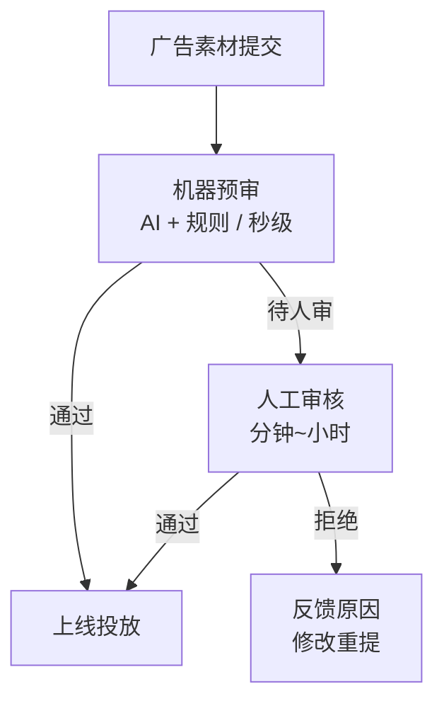

# 广告审核与合规 (Ad Review & Compliance)

## 一句话概述

广告审核是广告上线前的质量关卡，通过机器审核+人工审核的方式确保广告内容合法合规、真实准确，保护用户权益和平台生态。

---

## 审核体系



---

## 审核内容

### 文字审核

| 检测项 | 说明 | 技术 |
|--------|------|------|
| **违禁词** | 政治敏感、色情、暴力 | 关键词匹配 + NLP |
| **绝对化用语** | "最好"、"第一"、"国家级" | 规则 + NLP |
| **虚假宣传** | "保证收益"、"无副作用" | NLP 语义理解 |
| **竞品贬低** | 贬低竞争对手 | NLP |
| **联系方式** | 非法引流 (微信号/QQ号) | 正则 + NLP |
| **价格欺诈** | 虚假价格、虚假折扣 | 规则校验 |

### 图片审核

| 检测项 | 技术 |
|--------|------|
| **色情内容** | 图像分类模型 |
| **暴力血腥** | 图像分类模型 |
| **政治敏感** | 人脸识别 + 图像分类 |
| **OCR 文字** | OCR → 文字审核 |
| **品牌 Logo** | 目标检测 |
| **二维码** | 二维码检测 |
| **水印** | 水印检测 |
| **图片质量** | 模糊/变形/拉伸检测 |

### 视频审核

| 检测项 | 技术 |
|--------|------|
| **关键帧提取** | 抽帧 → 图片审核 |
| **音频审核** | ASR → 文字审核 |
| **人脸检测** | 未授权人物使用 |
| **场景识别** | 不当场景检测 |
| **字幕提取** | OCR → 文字审核 |

### 落地页审核

| 检测项 | 说明 |
|--------|------|
| **页面可访问** | 落地页是否能正常打开 |
| **内容一致性** | 广告素材与落地页内容是否一致 |
| **诱导行为** | 是否存在诱导下载/关注 |
| **隐私合规** | 是否有隐私政策、数据收集说明 |
| **恶意代码** | 是否包含恶意脚本 |

---

## 行业准入

### 特殊行业资质要求

| 行业 | 资质要求 | 审核重点 |
|------|---------|---------|
| **医疗** | 医疗广告审查证明、执业许可证 | 不得保证疗效 |
| **药品** | 药品广告审查批文 | OTC 标识、禁忌说明 |
| **金融** | 金融许可证、ICP 备案 | 风险提示语必须展示 |
| **教育** | 办学许可证 | K12 学科培训限制 |
| **食品** | 食品经营许可证 | 不得宣称疗效 |
| **游戏** | 版号、适龄提示 | 防沉迷提示 |
| **房地产** | 预售许可证 | 不得承诺升值 |
| **酒类** | 酒类流通许可证 | 不得面向未成年人 |
| **保健品** | 保健食品批准文号 | "本品不能代替药物" |

### 禁止投放的行业/内容

```
绝对禁止:
  - 毒品及相关用品
  - 枪支弹药
  - 赌博 (非法)
  - 色情服务
  - 假冒伪劣商品
  - 传销
  - 非法金融 (套路贷、非法集资)
```

---

## 广告法核心条款

### 《中华人民共和国广告法》要点

```
第四条: 广告不得含有虚假或者引人误解的内容，不得欺骗、误导消费者

第九条 禁止情形:
  (一) 使用"国家级"、"最高级"、"最佳"等用语
  (二) 损害国家的尊严或者利益
  (三) 妨碍社会安定
  (四) 危害人身、财产安全
  (五) 妨碍社会公共秩序
  (六) 含有淫秽、色情、赌博、迷信、恐怖、暴力的内容
  (七) 含有民族、种族、宗教、性别歧视的内容
  (八) 妨碍环境、自然资源保护
  (九) 法律、行政法规规定禁止的其他情形

第十四条: 广告应当具有可识别性，能够使消费者辨明其为广告
  → 必须标注"广告"标识

第二十八条: 虚假广告的认定
  - 商品或服务不存在
  - 信息与实际不符
  - 使用虚构的数据/证明
```

---

## 审核效率与质量

### 审核 SLA

| 指标 | 目标 |
|------|------|
| **机审通过率** | > 80% (无需人审) |
| **机审耗时** | < 3秒 |
| **人审耗时** | < 2小时 (工作时间) |
| **误拒率** | < 3% |
| **漏放率** | < 0.1% |

### 审核质量保障

```
质量控制:
  1. 双审机制: 重要行业双人审核
  2. 抽检复审: 随机抽检已审核素材
  3. 申诉机制: 广告主可以申诉审核结果
  4. 模型迭代: 持续优化机审模型
  5. 规则更新: 跟踪法规变化，及时更新规则
```

---

## 与大数据开发的关联

- **审核数据管道**: 审核结果的记录和分析
- **违规数据分析**: 违规类型分布、趋势分析
- **模型训练数据**: 审核标注数据用于训练审核模型
- **审核效率报表**: 审核时效、通过率等指标监控

---

## 面试高频问题

1. 广告审核的流程是怎样的？机审和人审如何配合？
2. 广告法中有哪些与在线广告相关的核心条款？
3. 特殊行业广告的资质要求有哪些？
4. 如何平衡审核效率和审核质量？

---

## 推荐阅读

- 《中华人民共和国广告法》
- 《互联网广告管理办法》(2023 修订)
- 各平台广告审核规范
