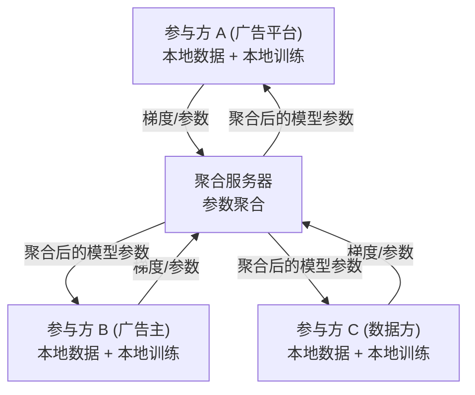
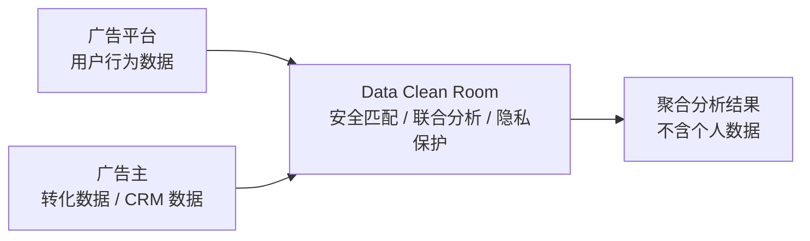

# 隐私技术 (Privacy-Enhancing Technologies)

## 一句话概述

隐私技术是在保护用户隐私的前提下实现广告精准投放的技术方案，包括联邦学习、差分隐私、隐私沙盒、数据清洁室等，是后 Cookie 时代广告行业的核心技术方向。

---

## 隐私技术全景

| 数据不出域 | 数据加密计算 | 数据匿名化 | 设备端 |
|-------------|-------------|-------------|--------|
| 联邦学习 | 同态加密 | 差分隐私 | 端侧推理 |
| 数据清洁室 | 安全多方计算 | K-匿名 | 隐私沙箱 |
| | TEE (可信执行) | 数据脱敏 | On-device |

---

## 联邦学习 (Federated Learning)

### 定义
多个参与方在不共享原始数据的前提下，协作训练机器学习模型。数据不出域，模型参数/梯度在参与方之间传递。

### 联邦学习架构



### 联邦学习分类

| 类型 | 说明 | 广告应用 |
|------|------|---------|
| **横向联邦** | 参与方有相同特征，不同样本 | 多个广告平台联合建模 |
| **纵向联邦** | 参与方有相同样本，不同特征 | 广告平台 + 广告主联合建模 |
| **联邦迁移** | 参与方样本和特征都不同 | 跨域知识迁移 |

### 广告场景应用

```
场景1: 广告平台 + 广告主联合建模 (纵向联邦)
  广告平台: 用户行为数据 (浏览/点击)
  广告主: 用户转化数据 (购买/注册)
  → 联合训练 CVR 模型，双方数据不出域

场景2: 多平台联合人群扩展 (横向联邦)
  平台A: 用户群体1的行为数据
  平台B: 用户群体2的行为数据
  → 联合训练 Lookalike 模型

场景3: 跨设备用户识别
  多个 App 的用户数据联合建模
  不共享原始设备 ID
```

---

## 差分隐私 (Differential Privacy)

### 定义
通过在数据或查询结果中添加随机噪声，保证单个用户的数据不会显著影响输出结果，从而保护个体隐私。

### 核心概念

```
ε-差分隐私:
  对于任意两个相邻数据集 D 和 D' (仅差一条记录):
  Pr[M(D) ∈ S] ≤ e^ε × Pr[M(D') ∈ S]

  ε (隐私预算):
    ε 越小 → 隐私保护越强 → 数据可用性越低
    ε 越大 → 隐私保护越弱 → 数据可用性越高
    
    典型值: ε = 1~10

噪声添加方式:
  - Laplace 机制: 添加 Laplace 噪声 (数值查询)
  - 指数机制: 按概率选择输出 (分类查询)
  - 高斯机制: 添加高斯噪声 (松弛差分隐私)
```

### 广告场景应用

```
场景1: 聚合报表
  广告效果报表中添加噪声
  单个用户的行为不会被推断
  报表整体趋势仍然准确

场景2: 模型训练 (DP-SGD)
  训练过程中对梯度添加噪声
  模型不会记忆单个用户的数据
  Apple 和 Google 在广告归因中使用

场景3: 频率估计
  统计某个兴趣标签的用户数量
  添加噪声保护个体
  RAPPOR (Google) 使用本地差分隐私
```

---

## 隐私沙盒 (Privacy Sandbox)

### Google Privacy Sandbox

```
目标: 在淘汰第三方 Cookie 后，提供隐私保护的广告技术替代方案

核心 API:

1. Topics API (兴趣定向替代方案)
   - 浏览器根据用户浏览历史推断兴趣主题
   - 每周更新 5 个主题
   - 广告请求时返回 3 个主题 (每个 epoch 1 个)
   - 不暴露具体浏览历史

2. Attribution Reporting API (归因替代方案)
   - 事件级报告: 有限的转化数据 + 噪声
   - 汇总报告: 聚合数据 + 差分隐私
   - 延迟报告 (非实时)

3. Protected Audience API / FLEDGE (重定向替代方案)
   - 设备端竞价 (On-device Auction)
   - 广告主在用户设备上创建兴趣组
   - 竞价在设备端完成，不泄露用户数据
```

### Apple SKAdNetwork (SKAN)

```
iOS 隐私归因方案:

SKAN 流程:
  1. 用户点击广告
  2. 用户安装并打开 App
  3. App 调用 SKAN API 注册转化
  4. 设置转化值 (Conversion Value, 0-63)
  5. Apple 延迟 24-48 小时后发送归因回传
  6. 回传数据经过隐私处理 (聚合 + 噪声)

限制:
  - 无设备级别数据 (无 IDFA)
  - 转化值只有 6 bit (64 种可能)
  - 数据延迟 24-48 小时
  - 有一定概率添加噪声
  - 无法做实时优化

SKAN 4.0 改进:
  - 多次回传 (最多 3 次)
  - 粗粒度转化值 (low/medium/high)
  - Crowd Anonymity (人群匿名性)
```

---

## 数据清洁室 (Data Clean Room)

### 定义
安全的数据协作环境，多方可以在不暴露原始数据的前提下进行联合分析和建模。

### 架构



### 主要产品

| 产品 | 提供方 | 特点 |
|------|--------|------|
| **Ads Data Hub** | Google | Google 广告数据的安全分析 |
| **Advanced Analytics** | Meta | Facebook 广告数据分析 |
| **AWS Clean Rooms** | Amazon | 云上数据清洁室 |
| **巨量云图** | 字节跳动 | 国内广告数据协作 |
| **腾讯数据智库** | 腾讯 | 微信生态数据分析 |

### 应用场景

```
场景1: 广告效果归因
  广告平台提供: 广告曝光/点击数据
  广告主提供: 转化/购买数据
  → 在清洁室中匹配，计算转化率
  → 双方都看不到对方的原始数据

场景2: 人群洞察
  广告主上传: 高价值客户 ID (加密)
  广告平台: 分析这些用户的兴趣/行为特征
  → 输出聚合画像报告 (不含个体数据)

场景3: Lookalike 扩量
  广告主提供: 种子用户 (加密 ID)
  广告平台: 在清洁室中计算相似用户
  → 输出人群包 (不暴露具体用户)
```

---

## 可信执行环境 (TEE)

### 定义
硬件级别的安全计算环境，数据在加密的内存区域中处理，即使操作系统管理员也无法访问。

```
TEE 方案:
  - Intel SGX (Software Guard Extensions)
  - ARM TrustZone
  - AMD SEV (Secure Encrypted Virtualization)

广告应用:
  - 在 TEE 中进行用户匹配和归因
  - 数据在加密环境中处理
  - 结果输出前经过隐私处理
```

---

## 端侧计算 (On-Device)

### 设备端广告技术

```
趋势: 将部分广告逻辑从云端迁移到用户设备端

设备端能力:
  1. 兴趣推断: 在设备端分析用户行为，推断兴趣
     (Topics API, Apple 端侧 ML)
  
  2. 设备端竞价: 广告竞价在设备端完成
     (Protected Audience API / FLEDGE)
  
  3. 端侧模型: 在设备端运行轻量级推荐/排序模型
     (Core ML, TensorFlow Lite)
  
  4. 本地频控: 在设备端实现频次控制

优势:
  - 用户数据不离开设备
  - 完全保护隐私
  - 低延迟

挑战:
  - 设备算力有限
  - 模型需要足够轻量
  - 难以做全局优化
```

---

## 与大数据开发的关联

- **联邦学习平台**: 联邦学习框架的部署和数据管道
- **差分隐私实现**: 在数据管道中集成差分隐私机制
- **数据清洁室**: 安全数据匹配和联合分析的技术实现
- **数据脱敏**: 个人数据的加密、哈希、脱敏处理
- **隐私合规审计**: 数据使用的合规性检测和审计

---

## 面试高频问题

1. 联邦学习的原理是什么？在广告中如何应用？
2. 差分隐私是什么？ε 参数的含义？
3. Google Privacy Sandbox 的核心 API 有哪些？
4. SKAdNetwork 的工作原理和限制？
5. 数据清洁室解决了什么问题？

---

## 推荐阅读

- [Google Privacy Sandbox 文档](https://privacysandbox.com/)
- [Apple SKAdNetwork 文档](https://developer.apple.com/documentation/storekit/skadnetwork)
- [联邦学习白皮书](https://arxiv.org/abs/1912.04977)
- 《联邦学习》— 杨强
