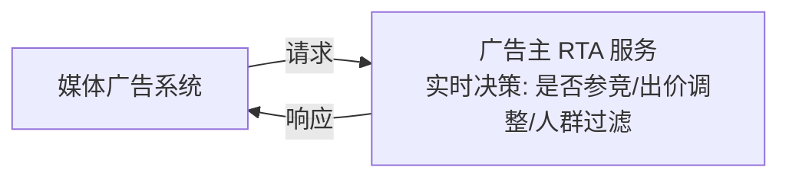

# 国内主要玩家 (China Players)

## 一句话概述

中国数字广告市场由字节跳动、阿里巴巴、腾讯、百度、快手五大巨头主导，形成"围墙花园"式的闭环生态，各平台自建投放系统，独立 DSP/SSP 空间有限。

---

## 市场格局

中国数字广告市场份额 (2024 估计):

| 平台 | 市场份额 |
|------|----------|
| **字节跳动** | ~28% |
| **阿里巴巴** | ~20% |
| **腾讯** | ~16% |
| **百度** | ~7% |
| **快手** | ~5% |
| **拼多多** | ~5% |
| **其他** | ~19% |

---

## 字节跳动 / 巨量引擎

### 产品矩阵

| 产品 | 类型 | 说明 |
|------|------|------|
| **巨量引擎** | 投放平台 | 统一广告投放入口 |
| **抖音广告** | 信息流/搜索 | 短视频信息流 + 搜索广告 |
| **今日头条** | 信息流 | 资讯信息流广告 |
| **穿山甲** | 联盟 (SSP) | 国内最大移动广告联盟 |
| **巨量千川** | 电商广告 | 抖音电商广告投放 |
| **巨量星图** | 达人营销 | KOL/达人广告合作 |
| **巨量云图** | DMP | 数据管理和人群洞察 |
| **巨量创意** | 创意工具 | AI 创意生成和管理 |

### 核心优势

- **流量规模**: 抖音 DAU 7亿+，头条 DAU 3亿+
- **推荐算法**: 业界领先的推荐算法，广告与内容深度融合
- **短视频生态**: 短视频广告形式创新，竖版视频成为主流
- **电商闭环**: 抖音电商 + 巨量千川，广告到交易闭环
- **穿山甲联盟**: 国内最大联盟，覆盖数十万 App

### 广告系统特点

```
计费模式: oCPM 为主 (效果广告)
出价方式: 目标转化出价 / 最大转化量 / 控成本投放
定向能力: 
  - 基础定向 (地域/年龄/性别/设备)
  - 兴趣行为定向 (抖音行为数据)
  - 自定义人群 (DMP 人群包)
  - 智能放量 (系统自动扩展)
  - RTA (实时 API)

特色功能:
  - 深度转化优化 (付费/留存/ROI)
  - 自动创意 (程序化创意)
  - 搜索广告 (抖音搜索)
  - 直播广告 (直播间引流)
```

### 广告收入
- 2023 年国内广告收入: ~¥3,000 亿

---

## 阿里巴巴 / 阿里妈妈

### 产品矩阵

| 产品 | 类型 | 说明 |
|------|------|------|
| **阿里妈妈** | 投放平台 | 统一营销平台 |
| **直通车** | 搜索广告 | 淘宝/天猫搜索竞价 |
| **引力魔方** | 推荐广告 | 猜你喜欢等推荐位 |
| **万相台** | 智能投放 | AI 全自动投放 |
| **品牌特秀** | 品牌广告 | 开屏/焦点图等品牌资源 |
| **达摩盘** | DMP | 电商数据管理平台 |
| **Uni Marketing** | 全域营销 | 品效协同 |

### 核心优势

- **电商数据**: 最完整的电商消费数据 (搜索/浏览/购买)
- **交易闭环**: 广告→浏览→加购→支付的完整闭环
- **ROAS 优化**: 电商场景天然适合 ROAS 导向优化
- **AIPL 模型**: 认知(Awareness)→兴趣(Interest)→购买(Purchase)→忠诚(Loyalty)

### 广告系统特点

```
计费模式:
  直通车: CPC (点击计费)
  引力魔方: CPM / oCPM
  万相台: 按效果付费 (ROI 导向)

特色:
  - 关键词竞价 (直通车)
  - 商品推荐广告
  - 店铺推广
  - 大促资源 (双11/618)
  - 全站推广 (跨淘宝/天猫/优酷/高德)
```

### 广告收入
- 2023 年客户管理收入 (广告): ~¥2,500 亿

---

## 腾讯 / 腾讯广告

### 产品矩阵

| 产品 | 类型 | 说明 |
|------|------|------|
| **腾讯广告** | 投放平台 | 统一投放入口 |
| **微信广告** | 社交广告 | 朋友圈/公众号/小程序/视频号 |
| **QQ 广告** | 社交广告 | QQ 空间/QQ 浏览器 |
| **腾讯视频广告** | 视频广告 | 前贴片/信息流 |
| **优量汇** | 联盟 (SSP) | 移动广告联盟 |
| **腾讯数据智库** | DMP | 社交数据管理 |

### 核心优势

- **微信生态**: 微信 13 亿+ MAU，朋友圈/公众号/小程序/视频号
- **社交数据**: 社交关系图谱，社交行为数据
- **小程序生态**: 小程序广告 + 小程序电商
- **视频号增长**: 视频号广告快速增长

### 广告系统特点

```
微信广告位:
  - 朋友圈广告: 品牌+效果，eCPM 最高
  - 公众号底部/文中广告
  - 小程序广告 (Banner/插屏/激励视频)
  - 视频号信息流广告
  - 搜一搜广告

计费模式: oCPM / oCPC
特色:
  - 社交定向 (好友关系、社交行为)
  - 微信生态闭环 (广告→小程序→转化)
  - 企业微信获客
  - 视频号直播引流
```

### 广告收入
- 2023 年网络广告收入: ~¥1,015 亿

---

## 百度 / 百度营销

### 产品矩阵

| 产品 | 类型 | 说明 |
|------|------|------|
| **百度营销** | 投放平台 | 统一投放入口 |
| **百度搜索广告** | 搜索广告 | 核心产品，关键词竞价 |
| **百度信息流** | 信息流广告 | 百度 App 信息流 |
| **百青藤** | 联盟 (SSP) | 移动广告联盟 |
| **观星盘** | DMP | 搜索意图数据 |
| **基木鱼** | 落地页工具 | 智能建站 |

### 核心优势

- **搜索意图数据**: 中国最大搜索引擎，用户意图数据
- **oCPC 先驱**: 搜索广告 oCPC 两阶段模式的开创者
- **AI 能力**: 文心大模型在广告中的应用

### 广告系统特点

```
搜索广告:
  - 关键词竞价 (精确/短语/广泛匹配)
  - 质量分机制
  - oCPC 两阶段出价
  - 智能创意 (动态标题/描述)

信息流广告:
  - 百度 App 信息流
  - oCPM 出价
  - 意图定向 (搜索意图 + 浏览意图)
```

### 广告收入
- 2023 年在线营销收入: ~¥750 亿

---

## 快手 / 磁力引擎

### 产品矩阵

| 产品 | 类型 | 说明 |
|------|------|------|
| **磁力引擎** | 投放平台 | 统一投放入口 |
| **磁力金牛** | 电商广告 | 快手电商广告 |
| **快手联盟** | 联盟 (SSP) | 移动广告联盟 |
| **磁力聚星** | 达人营销 | KOL 合作 |

### 核心优势

- **下沉市场**: 三四线城市用户占比高
- **老铁经济**: 强信任关系，直播电商转化率高
- **短视频+直播**: 短视频广告 + 直播带货

### 广告收入
- 2023 年线上营销收入: ~¥600 亿

---

## 其他重要玩家

### 拼多多

```
特点:
  - 电商搜索广告 + 推荐广告
  - 下沉市场用户基础
  - 极致性价比导向
  - 全站推广 (自动化投放)
广告收入: 2023 年 ~¥1,500 亿 (增速最快)
```

### 小红书

```
特点:
  - 种草营销平台
  - 聚光平台 (效果广告)
  - 蒲公英 (达人合作)
  - 女性用户为主，消费能力强
  - 搜索广告增长快
```

### B站 (哔哩哔哩)

```
特点:
  - Z 世代用户聚集
  - 中长视频广告
  - UP 主商业合作 (花火平台)
  - 游戏/教育/数码行业广告主集中
```

### 美团

```
特点:
  - 本地生活广告
  - 到店/到家场景
  - 搜索广告 + 推荐广告
  - 强交易意图
```

---

## 国内广告生态特点

### 围墙花园 (Walled Garden)

```
海外: 开放生态
  广告主 → 独立DSP → Ad Exchange → SSP → 媒体
  数据可以跨平台流通

国内: 围墙花园
  广告主 → 巨量引擎 → 抖音/头条 (数据不出字节)
  广告主 → 腾讯广告 → 微信/QQ (数据不出腾讯)
  广告主 → 百度营销 → 百度搜索 (数据不出百度)

影响:
  - 独立 DSP/DMP 空间被压缩
  - 广告主需要在多个平台分别投放
  - 跨平台归因困难
  - 数据孤岛问题严重
```

### RTA (Real-Time API)



作用: 弥补围墙花园下广告主缺乏数据控制的问题。主要平台: 巨量引擎、腾讯广告、快手均支持。

---

## 与大数据开发的关联

- **多平台数据整合**: 各平台投放数据的统一采集和管理
- **API 对接**: 各平台 Marketing API 的数据拉取
- **RTA 服务**: 广告主侧 RTA 服务的数据支撑
- **跨平台报表**: 统一口径的跨平台效果分析
- **归因整合**: 多平台归因数据的整合和去重

---

## 面试高频问题

1. 国内广告市场的主要玩家有哪些？各自的核心优势？
2. 国内广告生态和海外有什么区别？什么是围墙花园？
3. 字节跳动/巨量引擎的广告系统有什么特点？
4. 什么是 RTA？为什么国内需要 RTA？
5. 电商广告 (阿里/拼多多) 和信息流广告 (字节/腾讯) 的区别？

---

## 推荐阅读

- [巨量引擎官网](https://www.oceanengine.com/)
- [腾讯广告官网](https://e.qq.com/)
- [百度营销官网](https://yingxiao.baidu.com/)
- [QuestMobile 中国移动互联网报告](https://www.questmobile.com.cn/)
